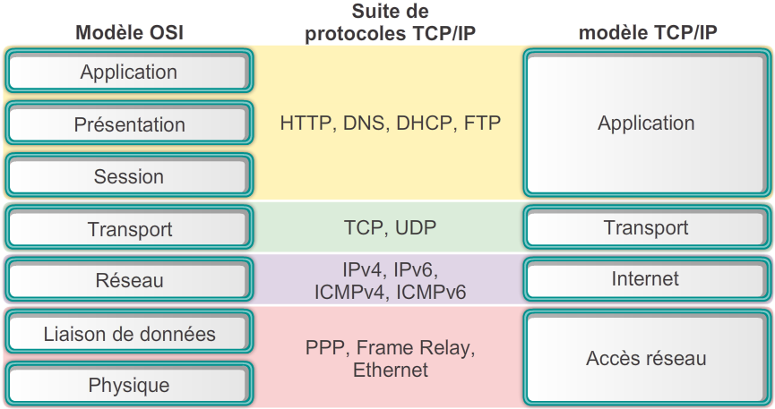
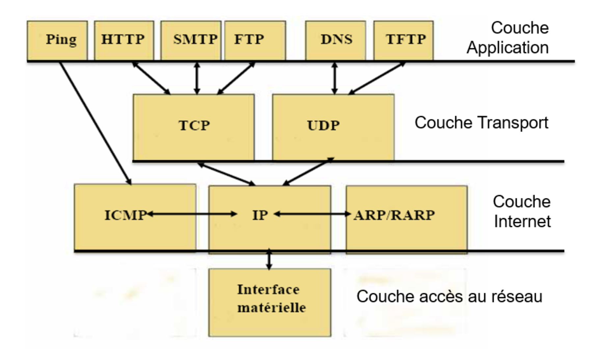

# Rappel du modèle TCP/IP

Le modèle TCP/IP, abréviation de Transmission Control Protocol/Internet Protocol, est un ensemble de protocoles de communication utilisés pour interconnecter des dispositifs sur des réseaux informatiques. Il divise la communication en couches, offrant ainsi une structure modulaire et flexible pour la transmission de données. Ce modèle comprend quatre couches principales : la couche Application, la couche Transport, la couche Internet et la couche Accès au réseau.

- Il se base sur un standard non propriétaire et ouvert
- Il fonctionne sur divers type de réseaux
- Donne la possibilité de réexpédier les paquets en cas d'enconbrement 

## I. Couche Application :

- Cette couche est responsable de l'interaction entre les applications utilisateur et le réseau.
- Elle comprend divers protocoles et services tels que HTTP (pour le web), FTP (pour le transfert de fichiers), SMTP (pour les emails), etc.
- Les données sont converties en un format compréhensible par les applications à cette couche.

## II. Couche Transport :

- Elle assure la transmission des données entre les applications.
- Les protocoles les plus courants dans cette couche sont TCP (Transmission Control Protocol) et UDP (User Datagram Protocol).
- TCP garantit une transmission fiable des données en s'assurant qu'elles sont reçues dans l'ordre et sans erreur, tandis qu'UDP est plus rapide mais moins fiable.

## III. Couche Internet :

- Elle est responsable de l'acheminement des paquets de données à travers le réseau.
- L'IP (Internet Protocol) est le protocole principal de cette couche, assignant des adresses uniques à chaque appareil et permettant le routage des paquets.

## IV. Couche Accès au réseau :

- Cette couche est également appelée couche de liaison de données ou couche réseau dans d'autres modèles de référence.
- Elle est responsable de la transmission de données entre les nœuds sur le même réseau local.
- Les technologies telles que Ethernet, Wi-Fi et PPP sont utilisées à cette couche pour fournir un accès au réseau.

Chaque couche du modèle TCP/IP joue un rôle crucial dans la transmission et la réception des données à travers le réseau, fournissant ainsi une structure modulaire et flexible pour la communication entre les appareils.

## Correspondance des Couches OSI/TCPIP

Le modèle OSI est plus théorique et comporte plus de couches, tandis que le modèle TCP/IP est plus pratique et s’inspire du modèle OSI pour certaines de ses couches.

## La pile de protocoles TCP/IP

Chaque couche a un rôle spécifique dans la communication réseau, et leur interaction permet un transfert efficace des données à travers le réseau

## Réseau : IPV4/6, RFC1918, CIDR et Découpage

IPv4 et IPv6 sont les deux principales versions du protocole Internet utilisées pour identifier et localiser les appareils sur un réseau. Alors qu'IPv4 utilise des adresses composées de 32 bits, son espace d'adressage limité a conduit au développement d'IPv6, qui utilise 128 bits pour les adresses, offrant un espace d'adressage considérablement plus grand pour répondre aux besoins futurs de connectivité. 

Dans la conception de réseaux, la gestion des adresses IP privées est cruciale. C'est là que RFC1918 entre en jeu, définissant les plages d'adresses IP réservées à une utilisation privée dans les réseaux locaux, telles que 10.0.0.0/8, 172.16.0.0/12 et 192.168.0.0/16. Pour gérer efficacement ces adresses et concevoir des réseaux, on utilise CIDR, qui permet une allocation flexible des adresses IP en spécifiant une adresse de réseau suivie d'un slash (/) suivi du nombre de bits à inclure dans le masque de sous-réseau. 

Le découpage de sous-réseau est alors utilisé pour partitionner ces réseaux en segments logiques, facilitant la gestion, la sécurité et l'optimisation des performances du réseau. En combinant ces concepts, les administrateurs réseau peuvent créer et gérer des réseaux efficaces, sécurisés et évolutifs, en utilisant IPv4 ou IPv6, en respectant les plages d'adresses réservées définies dans RFC1918 et en utilisant CIDR pour gérer les allocations d'adresses et les sous-réseaux.

## L'adressage IP

Sur un même réseau, chaque ordinateur doit avoir une adresse IP unique

- Une adresse IP (V4) est constitué de 4 octects
- 1 octet = 1 nombre binaire (1 ou 0, base 2) de 8 bits :
8 bits = 2puissance 8 = 256 => 1 octet = [0 - 255]
- Chaque octet est séparé par 1 point 
image illustration 

Adresse IP : 192.168.12.5 4 octets en notation décimale [1, 254] car certaines adresses sont réservées 
Masque de sous-réseau :  255.255.255.0 Le masque de sous-réseau définit combien d'adresse IP sont utilisables pour le réseau 
partie fixe et part modifiable
adresse réseau & adresse des ordinateurs
partie fix de l'ip  partie modifiable de l'ip

## le routage IP

Le routage IP est le processus de transfert de données d'un périphérique source à un périphérique de destination à travers un réseau informatique. L'Internet Protocol (IP) est le protocole utilisé pour adresser et acheminer ces données sur Internet et sur de nombreux réseaux locaux.

Lorsqu'un périphérique envoie des données, telles qu'un email ou une demande de site Web, il divise ces données en petits paquets. Chaque paquet contient des informations sur l'adresse IP du périphérique source, l'adresse IP du périphérique de destination, ainsi que les données elles-mêmes.

Le routage IP se produit à chaque point de connexion entre les réseaux. Chaque réseau est connecté à un routeur, qui est un périphérique spécialement conçu pour acheminer les paquets de données vers leur destination. Lorsqu'un routeur reçoit un paquet, il examine l'adresse IP de destination du paquet et consulte sa table de routage pour déterminer par quel port ou interface il doit envoyer le paquet pour qu'il se rapproche de sa destination.

Le routeur utilise différentes méthodes pour décider du chemin le plus efficace pour acheminer le paquet. Cela peut inclure des règles statiques définies par l'administrateur du réseau, ainsi que des informations dynamiques apprises grâce à des protocoles de routage comme OSPF ou BGP.

Les paquets peuvent passer par plusieurs routeurs avant d'atteindre leur destination finale. À chaque étape, le routeur examine l'adresse IP de destination du paquet et le transfère vers le prochain routeur qui le rapprochera de cette destination. Finalement, les paquets atteignent leur destination, où ils sont reconstitués pour former les données originales.

En résumé, le routage IP est le processus qui permet de transférer des données à travers un réseau en utilisant des routeurs pour déterminer le meilleur chemin vers la destination. C'est un aspect essentiel du fonctionnement d'Internet et des réseaux informatiques modernes.

## Conclusion

En conclusion, le protocole TCP/IP est le fondement de l'Internet moderne, fournissant une suite de règles permettant la communication efficace entre les appareils connectés. Sa structure en couches offre une flexibilité et une extensibilité essentielles pour répondre aux besoins évolutifs des réseaux. Grâce à sa robustesse, sa fiabilité et sa ubiquité, le TCP/IP reste un pilier incontournable des communications réseau, jouant un rôle crucial dans la connectivité mondiale et la transformation numérique.
