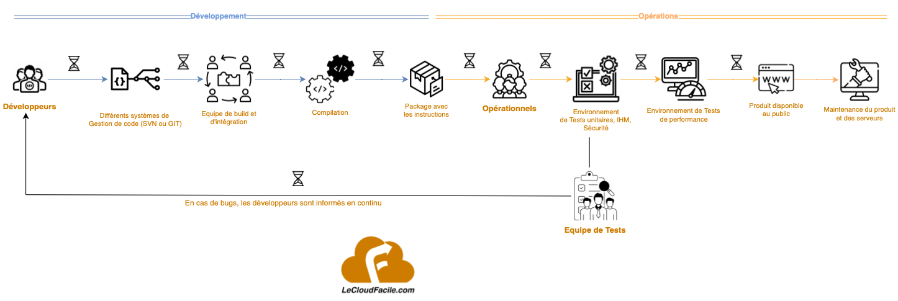
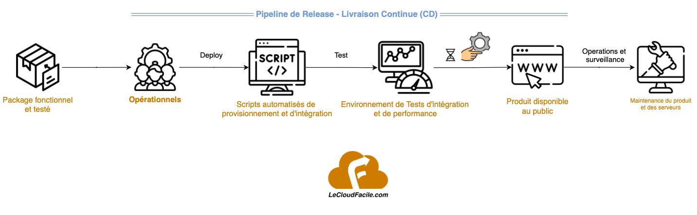

# Présentation de l'approche CI/CD

## Objectifs

- Comprendre le principe de CI-CD
- Comprendre la différence entre CI et CD
- Savoir le mettre en oeuvre

## Processus traditionnel de livraison d'un produit (logiciel)

On a vu précédemment que le DevOps agit d'abord sur les personnes et les processus en mettant en oeuvre une philosophie commune de collaboration entre les developpeurs et les opérationnels. Et ceci n'est rendu possible que par la mise en place d'un ensemble de pratiques mettant l'automatisation au coeur de cette nouvelle philosophie. 
Avant de définir ce qu'est le CI-CD, intéressons nous d'abord au processus traditionnel de livraison d'une application. 

Traditionnellement, le cycle de vie d'une application suivait ce schéma présenté ci-dessus :
- Différentes équipes de développements maintenaient leur code sur différents systèmes de versionning comme Git ou SVN. On pouvait meme se retrouver dans un scénario où tout le code source était uniquement sur le poste du développeur et non partagé sur un référentiel.
- Ensuite une équipe d'intégration ou de Build prenait le soin de compiler et d'intégrer le code selon l'instruction des développeurs. Le code devient alors un package compilé et disponible sur un serveur
- Ensuite ce package est envoyé à l'équipe opérationnelle chargée des environnements d'execution tels que la recette, la pre-production et la production
- Ces derniers poussent ainsi le code dans les environnements de Tests, recette pour permettre aux équipes de tests de lancer leurs scénarios de tests (la plupart du temps c'est fait de façon manuel)
- En cas de bugs, dysfonctionnements ou produit non conforme par rapport aux exigences métiers, ces derniers informent l'équipe de développement qui vont corriger le bug et repasser par le meme chemin. Cette unique étape peut prendre plusieurs semaines.
- Une fois le produit conforme et validé, les opérationnels prennent le relais pour l'envoyer en environnement de pre-production (ou autres) pour d'éventuels tests de performance avant de le livrer en production pour le rendre accessible au public

Ce chemin classique prend en général un temps relativement conséquent (plusieurs semaines à plusieurs mois) entre la phase de code et son déploiement aux clients.
Et il en découle plusieurs aller-retour incessant générateurs de beaucoup de frustrations et de tensions entre les différentes parties prenantes (Dev, testeurs, opérationnels)
De plus tout rajout de nouvelles fonctionnalités n'est pas la bienvenue avec cette aproche qui ne favorise pas l'agilité.
Ceci étant du :
- au cloisonnement entre les équipes
- à des processus manuels générateurs de pas mal d'erreurs humaines
- à une communication pas facile entre les différents intervenants n'ayant pas les memes contraintes et objectifs  

## Définition et principe

C'est là que la pratique CI-CD vient à la rescousse !
Le **CICD** est juste un ensemble de process, outils et techniques pour mieux gérer et automatiser la livraison d'applications, de la production du code à la construction, au test, packaging et déploiement avec l'aide de "pipelines" automatisés.
De ce fait, le déploiement vers la production ne necessitera plus toutes ces interventions manuelles et retours en cas de non-conformité mais plutot à une série d'actions executées les uns à la suite des autres de façon automatisé qu'on appelle pipeline CI/CD.
Le **CI** pour dire **C**ontinuous **I**ntegration (Intégration Continue) et le **CD** pour **C**ontinuous **D**elivery (Livraison Continue) ou **C**ontinuous **D**eployment (Déploiement Continu).
Ainsi toutes les 8 étapes identifiées dans le cycle de vie d'une application pourront etre entièrement automatisées. 
Lorsqu'un code est poussé sur un référentiel de gestion de code (tel que GIT), un pipeline est déclenché pour automatiser le build, tests et déploiement vers les environnements cibles.

Cette approche offre son lot de bénéfices :
- Accélération des livraisons et la réduction du Time-To-Market des applications
- Réduction des erreurs humaines et fiabilisation des livraisons
- Réduction des bugs en production grâce à la détection des erreurs au plus tôt (shift to left) 
- Automatisation et surveillance continue durant tout le cycle de vie de notre application
- Multiplication des livraisons dans la journée
- Amélioration de la relation entre les développeurs, testeurs et opérationnels

## Intégration Continue Vs livraison et Déploiement Continu

En reprenant notre exemple précédent sur le processus traditionnel de livraison des applications, on pourra noter la différence entre le CI (Intégration Continue) et le CD (Livraison ou Déploiement continu).

### Intégration Continue (CI)

L'intégration continue désigne comment les développeurs intègrent du code en continu, vers un repository partagé (registry, outil de gestion d'artifacts), plusieurs fois par jour avec l'aide de l'automatisation.
- Les développeurs gèrent le cycle de vie du code via un réferentiel unique (GIT)
- Une fois le code poussé, en fonction du langage, il est automatiquement buildé et testé (test unitaires, test d'IHM, test de vulnérabilité)
- Et une fois le package validé, il est mis à disposition sur un référentiel partagé (registry privé pour les images Docker, ou outil de gestion d'artifacts) en attendant d'etre déployé en production

L'objectif de cette phase est d'obtenir un produit toujours fonctionnel.

### Livraison Continue (CD)

De son coté, la livraison continue désigne le fait de déployer de façon continue et automatisée un produit de sa phase de code jusqu'en production. Cependant il nécessite une intervention manuelle avant le déploiement final en production.
Arpès l'intégration continue, le package est pris en compte par le pipeline de livraison continue, gèré par les opérationnels, qui permettra de l'acheminer vers les environnements de production via des scripts automatisés.
Des tests de performance automatisés peuvent etre executés dans les environnements de pre-prduction avant qu'une intervention manuelle ne l'achemine vers le public concerné.

L'objectif de cette phase est d'obtenir un produit toujours accessible.

### Déploiement Continue (CD)

Le déploiement continu est pareil que la livraison continue. La seule différence résidant sur le fait que le produit est acheminé automatiquement en production sans necessiter une intervention manuelle.
Le pipeline est automatisé de bout en bout.

L'objectif de cette phase est d'obtenir un produit toujours validé et fonctionnel délivré au client.

En fonction des entreprises, du contexte et des usages, on peut avoir le choix d'utiliser soit une livraison continue ou un déploiement continu.

## Conclusion

L'application du DevOps repose techniquement sur l'utilisation de l'approche CICD qui consiste à automatiser tout le cycle de vie et de déploiement d'une application.
De façon plus concret, cela n'est possible qu'avec l'utilisation commune d'un ensemble d'outils sur chacune de ces phases pour un pipeline automatisé de bout en bout.
Ce qu'on va décrouvrir sur le prochain cours.
