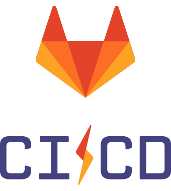

# Panorama des outils DevOps
On a vu précédemment que le DevOps agit d'abord sur les personnes en mettant en place une philosophie commune de collaboration entre les developpeurs et les opérationnels rendu possible par la mise en place d'un ensemble de pratiques tels que le CI/CD. Cette pratique n'est rendu possible qu'avec la mise en place d'un ensemble d'outils et de techniques permettant d'automatiser la livraison d'applications, de la production de code à la construction, au test, au packaging jusqu'au déploiement.
Ces outils sont au coeur de la pratique DevOps et un choix judicieux de ces derniers est essentiel pour implémenter au maximum cette philosophie au sein d'une équipe.
De nombreux outils sont disponibles sur le marché et chacun répond à un objectif unique, agissant sur une ou plusieurs phases du cycles DevOps, tout en offrant diverses fonctionnalités.

Etant donné la richesse de l'ecosystème DevOps en matière d'outils et possibilités, on pourra retrouver ci-dessous quelques exemples d'outils on exhaustifs parmi les plus populaires utilisés actuellement sur le marché et qui peuvent etre actionné via un pipeline CI/CD.

## Exemple d'outils populaires sur chaque phase du cycle CI/CD

### Outils de planification et de collaboration (Plan)

  ***Jira*** est un outil de planification puissant de la suite atlassian offrant des fonctionnalités de gestion de projet (notamment agiles)

  ***Slack*** est un outil de communication collaborative intégrable facilement dans un ecosystème d'automatisation

  ***Microsoft Teams*** est un outil de communication collaborative de la suite Microsoft offrant multiples possiblités notamment de pouvoir recevoir des notifications provenant des autres outils 

  ***Trello*** est un outil de de planification et gestion de projet (en mode Kanban) de la suite atlassian (comme Jira mais gratuit et offrant moins de fonctionnalités)

 

### Outils de gestion du code source

  ***GitHub*** est une plateforme web d'hébergement de code et de référentiels GIT open source et privé. Il permet la collaboration de l'équipe lors de la phase de code de manière plus centralisé et efficace. Il offre une version gratuite et open-source en mode SAAS mais également des versions payantes permettant plus de cloisonnement et de sécurité.

  ***Gitlab*** Concurrent de GitHub avec les memes fonctionnalités d'hébergement et de collaboration du code source. Il offre des versions en mode SAAS et self-managed pour plus d'indépendance et confidentialité dans la gestion des données hébergées.

  ***Bitbucket*** Comme ses deux autres concurrents, c'est une plateforme d'hébergement et gestion du code source. L'avantage est qu'il s'interface de façon native avec les autres outils de la suite atlassian (comme Jira, trello, Confluence,...)

 
  
### Outils de build du code source 

En fonction du langage de programmation utilisé, on peut retrouver plusieurs outils populaires s'intégrant facilement dans la partie CI de notre cycle d'automatisation comme :

  ***Apache Maven*** Un outil d'automatisation de build utilisé principalement pour les projets JAVA pour gèrer la compilation du code ainsi que toutes les dépendances

  ***Gradle*** est également un outil d'automatisation de build pour les langages de programmation JAVA, Kotlin et Groovy

  ***NPM*** est le gestionnaire de paquets par défaut des projets nodeJS et permet l'automatisation du build de ces types de projet 

  ***Nexus*** Outil Open source d'hébergement de packages et dépendances nécessaires aux applications (rpm, jar, war, sql, zip,.exe,...)

  ***Harbor*** Outil Open source d'hébergement et gestion privée des images Docker 

 

### Outils de tests 

Lors de la phase de test, on peut retrouver plusieurs outils de tests automatisés permettant des tests unitaires, de performance, de qualité, de sécurité et d'intégration comme :

  ***Sonarqube*** Outil open-source populaire de test de la qualité du code (qualimétrie). Il permet de mesurer la qualité du code pour identifier les défauts, duplications, problèmes de performance, eventuelles failles de sécurité ainsi que la mise en place de barrières qualité qui peuvent bloquer un pipeline si les exigences ne sont pas remplies

  ***Selenium*** Outil automatisé de tests fonctionnels d'IHM afin de s'assurer que l'application est conforme aux exigences métiers et qu'on a pas des écarts de comportement

  ***Appium*** Outil d'automatisation de tests sur les applications mobiles (Android et IOS) 

  ***Apache Jmeter*** Outil d'automatisation des tests de performance (tests de charge) d'applications et de serveurs

  ***Octoperf*** Comme Jmeter, c'est un outil de test de performance automatisé en mode SAAS et self-managed mais payant

  ***Junit*** Framework Open Source de test unitaires pour le langage de programmation JAVA. On peut citer également **PHPUnit** pour du code PHP ou **PyUnit** pour du code en Python
 
  ***Trivy*** Outil de sécurité de scan des vulnérabilités d'images Docker, Git, Système etc.. On peut citer aussi l'outil **Snyk** qui rentre dans la meme catégorie

  ***Checkmarx SAST*** Outil de test de sécurité applicatif

 

### Outils d'orchestration de pipeline

Ces outils permettent l'automatisation, la gestion et l'orchestration de tout le cycle CI/CD à l'aide de pipelines

  ***Jenkins*** Outil open source de serveur d'automatisation permettant d'automatiser et d'orchestrer l'ensemble des taches allant du code, build, tests jusq'au déploiement à l'aide de pipelines

  ***Gitlab CI*** Pareil que Jenkins, Gitlab CI est une fonctionnalité de Gitlab permettant l'automatisation des taches via des pipelines CI/CD. L'avantage par rapport à Jenkins est qu'il est un outil devops complet de bout en bout

  ***Github Actions*** Comme ses deux autres compères, c'est une fonctionnalité de Github permettant l'automatisation des taches CI/CD via des workflows

On peut citer également des outils propriètaires comme ***AWS CodeCatalyst*** et **AWS Codepipeline** 

 

### Outils de release management

Cette phase marque un controle de la fin de phase de l'intégration continue avant de procèder au déploiement du produit vers les environnements de production. Un ensemble d'outils peut etre utilisé pour favoriser une meilleure synchronisation des équipes de developpement et de déploiement tels que :

  ***XL Release*** Outil payant qui offre une gestion complète de mise en production. Il s'intègre aux pipelines CI/CD et permet aux équipes de surveiller et d'automatiser le déploiement des applications ainsi que la synchronisation entre les différentes équipes

  ***Harness*** Outil payant proposant les memes fonctionnalités que XLRelease

  ***Azure DevOps*** Outil complet de gestion de release permettant aux équipes de gérer les livraisons de bout en bout via des pipelines

 

### Outils de provisionnement de ressources

  ***Terraform*** Outil d'instanciation et de provisionning automatisé d'infrastructures multi cloud et environnements (AWS, Azure, GCP, Openstack, On-Premise,..) 

  ***Open Tofu*** Fork de l'outil Terraform qui est open-source et offre les memes fonctionnalités que ce dernier en matière de provisionnig d'infrastructure

  ***AWS Cloudformation*** Outil propriètaire pour l'automatisation des infrastuctures AWS

  ***Vagrant*** Outil Open source pour la création et configuration d'environnements

 

### Outils d'orchestration et de management de la configuration

  ***Kubernetes*** Outil Open Source de gestion de l'orchestration des conteneurs Docker (automatise le déploiement, la gestion et la mise en échelle,...)

  ***Openshift*** Pareil que Kubernetes, c'est une plateforme d'orchestrateur de conteneurs. La différence étant du fait que c'est un outil dont le propriètaire est Red Hat et non open source

  ***Ansible*** Outil Open source d'automatisation de la gestion de configuration des infrastructures

  ***Puppet*** Pareil que Ansible. La différence majeure réside sur la méthode d'application des configurations en mode pull avec la mise en place d'agents puppet

  ***Chef*** Pareil que Puppet. La différence majeure réside dans l'approche impérative du code

 

### Outils d'exploitation et de surveillance

  ***Prometheus*** Outil Open source de surveillance des infrastructures et applications. Il collecte, organise et stocke les donnéess (métriques) dans une base de données

  ***Grafana*** Outil Open source pour l'analyse et la visualisation de données collectées (par exemple données collectées depuis Prometheus)

  ***AlertManager*** Outil d'alerting et d'envoi de notifications vers des outils de communication collaborative comme Slack, Teams,...

  ***Centreon*** Outil de surveillance complet permettant la collecte des données, leur visualisation et l'envoi de notifications vers des canaux correspondants

  ***ELK*** (ElasticSearch Logstash Kibana) Suite d'outils permettant l'analyse, l'exploitation et le management centralisé des logs applicatifs et serveurs

  ***Grafana Loki*** Pareil que ELK pour la gestion centralisé des logs. Les deux sont gratuits mais celui ci est entièrement Open Source et s'intègre nativement avec Grafana

  ***Rundeck*** Outil Open source d'automatisation des taches d'admonistration de serveurs

 

### Outils de sécurisation des secrets

  ***Hashicorp Vault*** Outil de la suite Hashicorop permettant de stocker et sécuriser les informations sensibles telles que les identifiants/mot de passe de nos applications. IL propose une API et des intégrations avec la plupart des autres outils pour la récuperation et mise à jour de ces credentials. 

  ***AWS Secret Manager*** Comme hashicorp vault, il permet le stockage et la sécurisation de secrets sur AWS. Il offre aussi la possibilité d'auto-rotation de ces identifiants tout en prenant le soin de les mettre à jour au niveau des services AWS correspondants

  ***Azure Key Vault*** Outil de gestion de secret comme les deux précèdents mais sur Azure

## Plus d'outils

- Tableau périodique des outils DevOps --> https://digital.ai/learn/devsecops-periodic-table/

- Exemple avec la Stack CI/CD de Netflix

## Points Clés

Il est à noter que le choix de ces outils doit passer par une phase de compréhension des besoins spécifiques de l'entreprise pour éviter au maximum la multiciplicité d'outils et usages. 
Il sera donc essentiel de prendre en compte quelques facteurs lors de la selection de ces différents outils DevOps :

- **Identification des étapes clés** de développement de notre produit afin de maitriser le cycle de vie de notre application
- **Analyse et évaluation des ressources existantes** afin de s'assurer que les outils choisis seront compatibles avec notre infrastructure et éviter de dupliquer les outils
- **Evaluation des compétences de l'équipe** afin de choisir les meilleurs outils leur correspondant. Ce qui permettra de mener une conduite du changement efficace sur l'usage de ces nouveaux outils
- **Evaluation des Coûts** afin de choisir les bons outils correspondant aux contraintes budgétaires de l'entreprise
- **Adaptabilité et évolutivité** des outils choisis afin de s'assurer qu'ils pourront s'adapter au contexte changeant de l'ecosystème et de l'entreprise. Par exemple choisir des outils *provider agnostique* (ne dépendant pas d'un seul provider cloud) 

## Conclusion
L'ecosystème des outils DevOps est actuellement l'un des plus dynamique sur le marché et est en perpétuel expansion. Ceci étant dû à plusieurs facteurs :

- Besoins croissants des différents acteurs du marché
- Obsolescence rapide de certaines technologies 
- Retrait des licences Open source et/ou rachat de certaines technos par les grosses entreprises

Une bonne application des principes DevOps passera donc forcément par une utilisation avec parcimonie de quelques uns de ces outils qu'on pourra découvrir dans la suite de ce parcours.

