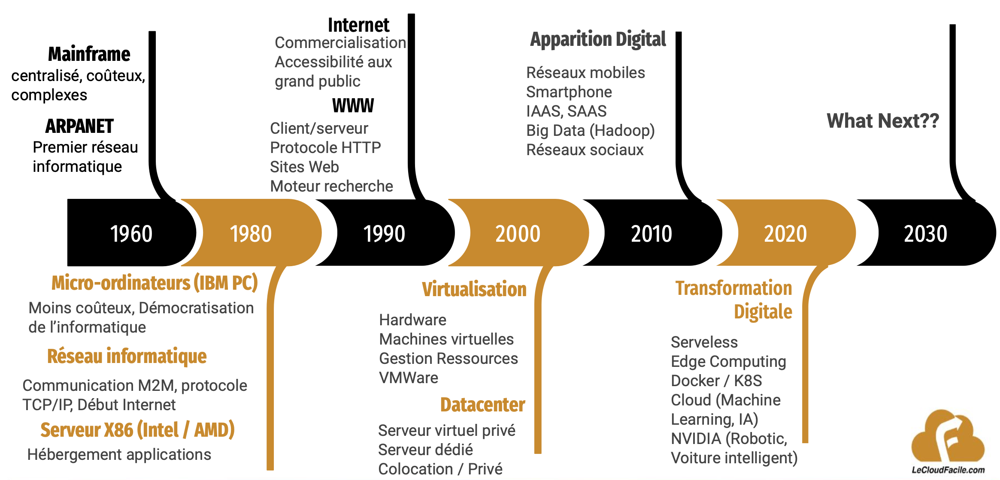

# Virtualisation application

## Contexte

L’évolution de l’infrastructure de 1960 à nos jours à permis de répondre progressivement aux attentes des utilisateurs qui deviennent de plus en plus exigeants. La figure ci-dessous montre l’apparition de quelques technologies dans le temps:

  

L’objectif de cette section permet de comprendre pourquoi et comment, sommes-nous arrivés à l’usage des conteneurs avant de faire un focus sur la technologie docker. 

## Serveurs Bare-metal

L’apparition des serveurs bare-metal vers les années 80 et la démocratisation de l’Internet vers les années 90 a permis le développement des architectures client/serveur. 
C’était une véritable évolution dans la centralisation des applications et l’ouverture vers un plus grand nombre d'utilisateurs.
La maintenance des applications est devenue simplifiée.

L’usage des serveurs bare-metal permet d’avoir une performance dédiée, une sécurité physique ainsi qu’un contrôle total de l'infrastructure. 

Cependant avec l’augmentation des applications, un certain nombre de problèmes émergent dans la gestion des parcs de serveurs bare-metal rendant ainsi complexe la maintenance et l'évolutivité de l’infra. 

Parmi les problèmes, nous pouvons noter:
- Un Capex (Coût d’acquisition) élevé
- Un temps acquisition et de mise en condition opérationnelle élevé
- une élasticité manuelle, limité & chronophage
- une complexité de la mise à jour des composants
- une exploitation fastidieuse
- une mauvaise gestion des ressources (sous-utilisation / sur-utilisation)
- une Intolérance aux pannes
- Etc.

Face à ces nombreux problèmes, nous assistons à l’apparition de la virtualisation matérielle.

## Virtualisation hardware

La virtualisation est une technologie que vous pouvez utiliser pour créer des représentations virtuelles de serveurs, de stockage, de réseaux à partir de machines physiques. L’hyperviseur imite les fonctions du matériel physique afin d’exécuter plusieurs machines virtuelles sur une seule machine physique.

La virtualisation matérielle permet de mutualiser les ressources des serveurs et d’optimiser l’usage des ressources. Elle facilite l’évolutivité et la flexibilité de l’infrastructure et fournit des mécanismes de durabilité (backup/restauration).

Elle permet également de garantir la haute disponibilité et la tolérance aux pannes de l’infrastructure. Ce qui facilite la  continuité /reprise d’activité après sinistre.

Avec l’avancée technologique, nous assistons également à une optimisation du temps de déploiement grâce à l’Infra As Code (ex: Terraform, Cloud formation, etc.) et du temps de  configuration grâce au management de la configuration (Ansible, puppet, chef, etc.). La disponibilité et l’accessibilité des ressources sont simplifiées avec l'apparition du Cloud Computing. 

Le déploiement des applications s’est simplifié avec l’apparition du DevOps qui automatisent via des supply chains, la construction et le déploiement. Afin de garantir la qualité et la sécurité des livrables, plusieurs environnements (lots de machine virtuelles) sont déployés dans le cycle de vie de logiciel. Par exemple, nous pouvons avoir les environnements : DEV, Staging, PROD

Cependant, nous notons également une certaine complexité liée:

- Dépendance aux hyperviseurs
- Surcoût lié à la virtualisation
- Problème de partage des ressources
- Portabilité des applications entre machines virtuelles (problèmes de dépendances, versions, etc.)
- Compatibilité avec les nouveaux paradigmes de développement (approche microservice)
- Etc.

Ces problèmes impactent la réduction du Time-To-Market pour répondre de manière efficiente aux exigences des utilisateurs. Ainsi pour répondre aux problèmes de la portabilité, nous assistons à la virtualisation applicative plus connue sous le nom de la conteneurisation

## Virtualisation applicative ou conteneurisation

La conteneurisation est une technique de virtualisation des applications reposant sur un noyau léger. 

Il permet l’exécution des applications dans des processus isolés avec une gestion efficiente des ressources. Il facilite la portabilité des applications en créant un package contenant le code ainsi que toutes ses dépendances: librairies, runtime, outils système, bibliothèques, etc. 

Cette portabilité influe fortement sur la réduction du Time-To-Market.
Il permet également la gestion efficiente des ressources entre processus et réduit considérablement le temps de démarrage des applications. 
Il est adapté aux architectures modernes (microservices par exemple) et offre des mécanismes de scalabilité des briques applicatives. Il existe plusieurs solutions sur le marché dont : Docker, Podman, containerd.

Dans la suite, nous allons faire un focus sur Docker qui est l'une des solutions pionnières de la virtualisation applicative.

## Docker

### Présentation

Docker est une plateforme logicielle permettant de faciliter le développement, le déploiement  et l’exploitation des applications à l'aide de conteneurs.

un conteneur permet au développeur de conditionner une application avec tous les composants et sous-composants dont elle a besoin, tels que des bibliothèques et d'autres dépendances, et de tout expédier sous la forme d'un package unique.

Docker repose sur 2 concepts fondamentaux dans les systèmes Linux à savoir:

- **Cgroups:** permet d'allouer des ressources (temps CPU, mémoire système, bande passante du réseau, etc.) entre des groupes de tâches (processus) définis par l'utilisateur et s'exécutant sur un système.

- **Namespace:** permet d'exécuter toute plusieurs processus de manière isolée sur une seule machine en veillant à ce qu'aucun d'entre eux n'interfère avec l'autre.

### Avantages / Inconvénients

#### Avantages

- Optimisation des ressources
- Compatibilité crross-platform (portabilité)
- Evolutivité & flexibilité
- Adaptabilité microservices

#### Inconvénients

- Problématique de sécurité
- Courbe d'apprentissage

### Architecture Docker

Docker fonctionne suivant une architecture client/serveur comme le montre la figure ci-dessous : 

  

- **Docker Daemon (Dockerd):** expose l'API Docker, réceptionne les requêtes utilisateurs et gère les objets Docker tels que les images, les conteneurs, les réseaux et les volumes. Un démon peut également communiquer avec d'autres démons pour gérer les services Docker.

- **Docker client :** principal moyen utilisé par de nombreux utilisateurs pour interagir avec Docker. Le client envoie ces commandes à dockerd, qui les exécute. Le client Docker peut communiquer avec plusieurs démons.

- **Docker Registry:** stocke les images Docker. Docker Hub est un registre public que tout le monde peut utiliser. Par défaut, Docker est configuré pour rechercher des images sur Docker Hub. Vous pouvez même exécuter votre propre registre privé.

### Concepts

Avant de plonger dans la partie technique de Docker, il est important de comprendre quelques concepts à savoir:
- **Image:**  Package contenant le code source de l’application ainsi que toutes les dépendances requises (librairies, runtime, bibliothèques)
- **Dockerfile:** Fichier texte contenant la recette de création d’une image Docker
- **Container:** Instance de l’image en cours d'exécution dans un environnement isolé fourni par Docker.
- **Docker compose:** Utilitaire permettant d'exécuter plusieurs containers sous forme de service unique.

## Gestion des conteneurs

### Cycle de vie des conteneurs

Pour mieux appréhender la gestion des conteneurs, il est important de comprendre le cycle de vie des conteneurs. Ce dernier est décrit par la figure ci-dessous:

  

Pour la gestion du cycle de vie des conteneur, Docker offre une large pallette de commande  que nous allons découvrir dans les chapitres à venir.