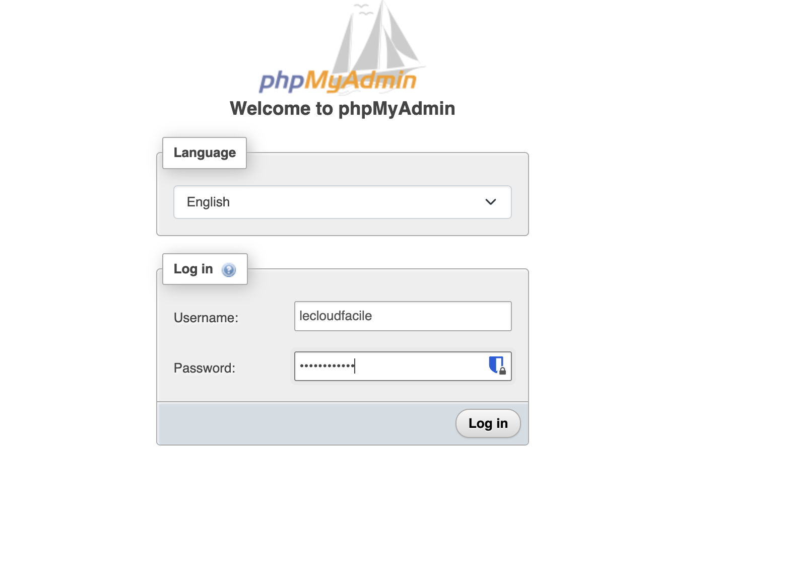
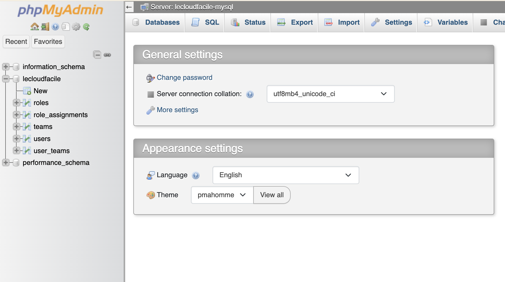
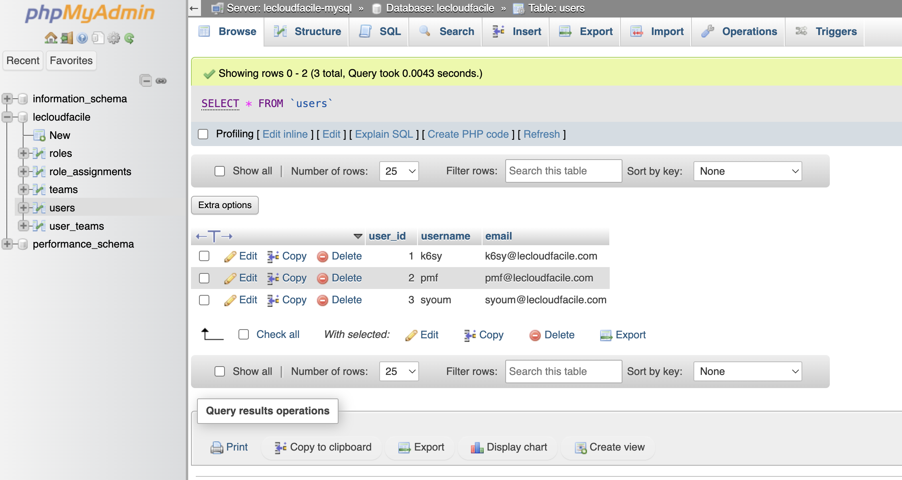

# LAB : mysql & phpMyAdmin sur Docker 

## Présentation

### Objectifs: 

- Utilisation des volumes Docker
- Utilisation des réseaux Docker
- Utilisation des variables d'environnement
- Déploiement d'une base de données `mysql`
- Déploiement du client `phpMyAdmin`
- Préchargement de la base de données

### Prérequis

- Connaissance de Docker
- Instance docker fonctionnel
- Editeur de code
- Utilitaire installé sur la machine: git


## Déroulement du Lab

### Etape 1 : Récupération du code source

La commande suivante permet de récupérer le code source contenant les fichiers sql pour précharger la base de données 

```
git clone https://github.com/wingufactory/lecloudfacile-devops-labs.git
cd lecloudfacile-devops-labs
```

### Etape 2 : Création d'un volume

La commande ci-dessous permet de créer un volume nommé `mysql-data` qui sera utilisé par le conteneur `mysql` pour la persistance des données:

```bash
$ docker volume create mysql-data 
```

Par défaut, c'est le driver `local` qui sera utilisé si aucun driver n'est spécifié.

Pour vérifier que le volume est bien créé, exécutez la commande suivante:


```bash
$ docker volume ls --filter name=mysql-data
```

### Etape 3 : Création d'un network

La commande ci-dessous permet de creér un réseau `mysql-network` qui permettra de faciliter la communication entre les conteneurs `mysql` et `phpMyAdmin`.

```bash
$ docker network create --attachable mysql-network
```

Par défaut, c'est le driver `bridge` qui sera utilisé si aucun driver n'est spécifié.

Pour vérifier que le réseau est bien créé, exécutez la commande suivante:

```bash
$ docker network ls --filter name=mysql-network
```

### Etape 4 : Création d'un conteneur mysql

La commande ci-dessous permet de créer un conteneur mysql nommé `lecloudfacile-mysql`. Avant execution, remplacez `<db-root-password>` et `<db-password>` par des mots de passe de votre choix.

```bash
$ docker run -d --name lecloudfacile-mysql\
  --network mysql-network\
  -e MYSQL_ROOT_PASSWORD=<db-root-password>\
  -e MYSQL_DATABASE=lecloudfacile\
  -e MYSQL_USER=lecloudfacile\
  -e MYSQL_PASSWORD=<db-password>\
  -v ./sql-dummy-data:/docker-entrypoint-initdb.d\
  -v mysql-data:/var/lib/mysql\
  mysql:lts
```

**Explication des options la commande**

- **docker run**: créer et démarrer un conteneur
- **-d** : executer le conteneur en arrière-plan
- **--name lecloudfacile-mysql** : donner le nom `lecloudfacile-mysql` au conteneur qui sera créé
- **--network mysql-network** : rattacher le conteneur au réseau `mysql-network`
- **-e MYSQL_ROOT_PASSWORD=`<db-root-password>`**: définir une variable d'environnement contenant le mot de passe du super-utilisateur root (***obligatoire***)
- **-e MYSQL_DATABASE=lecloudfacile**: définir une variable d'environnement pour la création d'une base données nommé `lecloudfacile` à créer à l'initisalition
- **-e MYSQL_USER=lecloudfacile**: définir une variable d'environnement pour la création d'un utilisateur nommé `lecloudfacile` à créer à l'initialisation. Cet utilisateur aura des accès super utilisateur(GRANT ALL) sur la base de données`lecloudfacile`
- **-e MYSQL_PASSWORD=`<db-password>`**: définir une variable d'environnement contenant le mot de passe de l'utilisateur `lecloudfacile`
- **-v ./sql-dummy-data:/docker-entrypoint-initdb.d** : monter le répertoire `sql-dummy-data` (contenant des fichiers sql et situé dans le folder lecloudfacile-devops-labs)  à l'emplacement `docker-entrypoint-initdb.d` du conteneur. Il a pour impact le préchargement des fichiers sql dans la base de données `lecloudfacile`. Attention, cette opération de préchargement ne se fait qu'à la première initialisation de la base de données et ne pourra plus se faire pour une base de données déjà intialisée.
- **-v mysql-data:/var/lib/mysql** : monter le volume `mysql-data` à l'emplacement `/var/lib/mysql` du conteneur pour la persistence des données
- **mysql:lts**: Utiliser la version `lts` de l'image `mysql`


Retrouvez plus de détails sur l'image [mysql](https://hub.docker.com/_/mysql)

Executez la commande suivante pour s'assurer que le conteneur est bien démarré.

```bash
$ docker ps -a --no-trunc --filter name=lecloudfacile-mysql
```

### Etape 5 : Vérification préchargement de la base de données

La commande suivante permet d'affciher les logs du conteneur et de vérifier que les fichiers sql ont été bien executés.

```bash
$ docker logs lecloudfacile-mysql 2>&1 | grep 'docker-entrypoint-initdb.d'
```

### Etape 6: Creation d'un conteneur phpmyadmin

La commande ci-dessous permet de créer un conteneur nommé `lecloudfacile-phpmyadmin`.

```bash
$ docker run -d --name lecloudfacile-phpmyadmin\
  -e PMA_HOST=lecloudfacile-mysql\
  -p 8086:80\
  phpmyadmin:5.2.1
```

**Explication des options la commande**

- **docker run**: créer et démarrer un conteneur
- **-d** : executer le conteneur en arrière-plan
- **--name lecloudfacile-phpmyadmin** : donner le nom `lecloudfacile-phpmyadmin` au conteneur qui sera créé
- **-e PMA_HOST=lecloudfacile-mysql** : spécifier l'instance MySQL (optionnel)
- **-p 8086:80**: permet d'exposer le port 80 du conteneur sur le port 8086 de la machine hôte
- **phpmyadmin:5.2.1**: Utiliser la version `5.2.1` de l'image `phpmyadmin`

Retrouvez plus de détails sur l'image [phpMyAdmin](https://hub.docker.com/_/phpmyadmin)

Le conteneur `lecloudfacile-phpmyadmin` n'est pas rattaché au même réseau de l'instance mysql `lecloudfacile-phpmyadmin`. Pour ce faire, il faut éxecutez la commande suivante pour attacher le conteneur au réseau `mysql-network`.

```bash
$ docker network connect mysql-network lecloudfacile-phpmyadmin
```

### Etape 7: Vérification de la connexion des conteneurs au réseau `mysql-network`

La commande suivante permet d'inspecter le réseau `mysql-network`.

```bash
docker inspect network mysql-network
```
Vérifiez sur la srtie de la commande précédente, dans la section `Containers`, que les 2 conteneurs `lecloudfacile-phpmyadmin` et `lecloudfacile-mysql` sont bien visibles.


### Etape8: Accès au client PHP

- Lancez le navigateur et accéder à l'url http://0.0.0.0:8086 puis utilisez les informations `MYSQL_USER` & `MYSQL_PASSWORD` définies à l'étape 4 pour se connecter



- Dépilez la base de données `lecloudfacile` et vérifiez que les tables s'affiche bien.



- Cliquez sur la table `users` et vérifiez que les données sont bien chargés.



## Insights

Nous avons à travers ce lab, demarrez plusieurs conteneurs dans une approche impérative. Cette façon de faire n'est pas très appropriée si nous avons plusieurs conteneurs.
Il est important de noter que Docker offre également une approche déclarative qui facilite la gestion et permet le versionning. Dans la suite, nous verrons comment compose peut faciliter la gestion des conteneurs.


