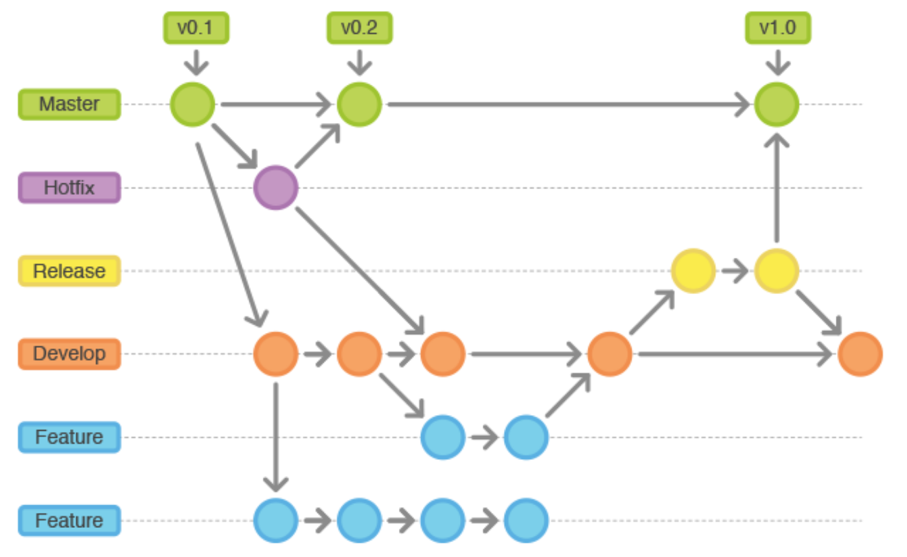

# À la découverte de Git

Git est un système de contrôle de version distribué utilisé pour gérer et suivre les modifications du code source dans des projets de développement logiciel. Il est conçu pour coordonner le travail entre plusieurs développeurs, conserver un historique complet des modifications, et faciliter la collaboration au sein des équipes de développement.

## 1. Mécanismes de Fonctionnement de Git

Git fonctionne en enregistrant des instantanés complets de vos fichiers à différents moments dans le temps. Contrairement à d'autres systèmes de versioning qui suivent uniquement les modifications, Git enregistre l'état complet du projet à chaque commit, mais optimise l'espace en liant les versions inchangées des fichiers aux commits précédents.

### Mécanisme de Base :
- **Snapshots** : Git enregistre des snapshots des fichiers au lieu de conserver des différences (diffs). Chaque commit est une référence à un snapshot complet de tous les fichiers du projet.
- **SHA-1 Hashing** : Chaque commit est identifié par un hash SHA-1 unique, garantissant l'intégrité des données et une identification sécurisée.
- **Local et Distribué** : Chaque copie d'un dépôt Git est une copie complète de l'historique du projet. Il n'y a pas de serveur central obligatoire, ce qui rend Git extrêmement résilient.

### Principales Composantes :
- **Repository (Dépôt)** : Un dossier contenant l'intégralité du projet, y compris l'historique des modifications et les configurations Git.
- **Working Directory (Répertoire de Travail)** : Les fichiers que vous voyez et modifiez directement dans votre éditeur de code.
- **Staging Area (Zone d'Indexation)** : Une zone intermédiaire où vous placez les modifications avant de les confirmer (commit).
- **Local Repository** : La base de données locale où les commits sont stockés.
- **Remote Repository** : Une version du dépôt située sur un serveur distant (ex : GitHub, GitLab, Gitea), utilisée pour partager des modifications entre collaborateurs.

## 2. Modèle de Branches dans Git
 
Git utilise un modèle de branches léger et flexible pour la gestion des modifications. Une branche dans Git est simplement un pointeur vers un commit spécifique dans l'historique.

### Pourquoi utiliser les branches ?
- **Isolation des modifications** : Chaque branche permet de développer des fonctionnalités, corriger des bugs ou expérimenter des idées sans affecter la branche principale (généralement `main` ou `master`).
- **Facilitation des Collaborations** : Plusieurs développeurs peuvent travailler en parallèle sur des branches différentes, fusionnant leurs changements uniquement lorsque le code est prêt.
  
### Branches Courantes :
- **Main/Master** : La branche principale stable du projet.
- **Feature Branches** : Utilisées pour développer de nouvelles fonctionnalités. Ex : `feature/login`
- **Bugfix Branches** : Pour corriger des bugs spécifiques. Ex : `bugfix/fix-crash`
- **Hotfix Branches** : Pour des corrections urgentes dans la branche principale. Ex : `hotfix/security-patch`

### Opérations sur les Branches :
- **Création** : Créer une nouvelle branche à partir de l'état courant.
- **Fusion (Merge)** : Combiner les modifications d'une branche dans une autre.
- **Rebase** : Réappliquer les commits d'une branche sur une autre branche, créant une histoire plus linéaire.

## 3. Commandes de Base Git

### 1. Initialisation et Configuration
- **Initialiser un dépôt Git** :

    ```bash
    git init
    ```
    
- **Cloner un dépôt existant** :

    ```bash
    git clone <URL>
    ```
   
- **Configurer un nom et un email pour les commits** :

    ```bash
    git config --global user.name "Votre Nom"
    git config --global user.email "votre.email@example.com"
    ```
    
### 2. Gestion des Fichiers
- **Vérifier le statut des modifications** :

    ```bash
    git status
    ```
     
- **Ajouter des fichiers à la zone d’indexation (Staging Area)** :

    ```bash
    git add <fichier>
    ```
    
- **Retirer des fichiers de la zone d’indexation** :

    ```bash
    git reset <fichier>
    ```
   
- **Ignorer certains fichiers avec `.gitignore`** :
    - Créez un fichier nommé `.gitignore` et ajoutez-y les fichiers ou répertoires que vous souhaitez ignorer.

### 3. Commits et Historique
- **Créer un commit** :

    ```bash
    git commit -m "Message de commit"
    ```
    
- **Voir l’historique des commits** :

    ```bash
    git log
    ```
   
- **Voir les différences entre les commits** :

    ```bash
    git diff
    ```

### 4. Gestion des Branches
- **Créer une nouvelle branche** :

    ```bash
    git branch <nom-branche>
    ```

- **Basculer sur une branche existante** :

    ```bash
    git checkout <nom-branche>
    ```
    
- **Créer et basculer sur une nouvelle branche directement** :

    ```bash
    git checkout -b <nom-branche>
    ```
    
- **Fusionner une branche dans la branche courante** :

    ```bash
    git merge <nom-branche>
    ```
    
- **Supprimer une branche** :

    ```bash
    git branch -d <nom-branche>
    ```

### 5. Travailler avec les Dépôts Distants
- **Ajouter un dépôt distant** :

    ```bash
    git remote add origin <URL>
    ```
    
- **Pousser les modifications vers un dépôt distant** :

    ```bash
    git push origin <nom-branche>
    ```
    
- **Récupérer les modifications depuis un dépôt distant** :

    ```bash
    git pull origin <nom-branche>
    ```

### 6. Opérations de retour en arrière (Rollback)
- **Annuler un commit sans modifier l'historique du référentiel** :

    ```bash
    git revert <commit>
    ```

- **Annuler un commit en le supprimant et en réécrivant l'historique** :

    ```bash
    git reflog : pour afficher l'historique des commits et identifier les pointeurs
    git reset --hard <identifiant pointeur>
    ```

<br>

Pour s'entrainer visuellement à l'utilisation des différentes opérations de Git, une application fort intéressante autant pour les débutants que les plus expérimentés --> https://learngitbranching.js.org/?locale=fr_FR


## 4. Workflows Git

Les workflows Git sont des stratégies pour organiser et gérer les branches et les versions du code. Ils aident les équipes à collaborer efficacement tout en maintenant une base de code stable.

### Principaux Workflows :

- **Feature Branch Workflow** : Chaque nouvelle fonctionnalité est développée dans une branche dédiée. Cela permet de travailler sur de nouvelles fonctionnalités en parallèle sans affecter la branche principale. Une fois terminée, la branche est fusionnée avec la branche principale via un pull request ou un merge.

- **Git Flow** : Ce workflow utilise deux branches principales : `main` (ou `master`) pour les versions stables et `develop` pour les travaux en cours. Les nouvelles fonctionnalités sont développées dans des branches dérivées de `develop` et les releases et hotfixes sont gérés par des branches spécifiques.

- **Forking Workflow** : Souvent utilisé pour les projets open source, chaque développeur clone le dépôt principal et travaille dans son propre fork. Les modifications sont ensuite soumises au dépôt principal via des pull requests.

- **Trunk-Based Development** : Tous les développeurs travaillent sur une seule branche principale (`trunk`) et effectuent des intégrations fréquentes. Les branches sont courtes et intégrées rapidement pour minimiser les conflits.

### Exemple du Workflow Git Flow



### Choix du Workflow :
Le choix du workflow dépend de la taille de l'équipe, de la complexité du projet, et des besoins de livraison. Par exemple, Git Flow est idéal pour les projets avec des cycles de releases structurés, tandis que Trunk-Based Development est adapté pour des déploiements continus.

## 5. Outils Graphiques pour Git

Bien que Git soit principalement utilisé en ligne de commande, plusieurs outils graphiques facilitent la visualisation de l'historique et la gestion des branches.

### Outils Graphiques Populaires :

- **GitKraken** : Un client Git visuel avec une interface intuitive pour la gestion des branches, des merges, et des rebases. Il intègre également des outils de gestion de projets comme Jira.

- **SourceTree** : Un client Git gratuit pour Windows et Mac, développé par Atlassian. Il offre une visualisation claire des branches, des commits, et des pull requests.

- **GitHub Desktop** : Développé par GitHub, cet outil facilite la gestion des dépôts GitHub, le commit, le push, et le pull sans utiliser la ligne de commande.

- **Visual Studio Code (VS Code)** : Avec ses extensions Git intégrées, VS Code permet de gérer les dépôts, effectuer des commits, gérer les branches et visualiser les différences de fichiers directement depuis l'éditeur.

### Avantages des Outils Graphiques :
- Simplification de la gestion des branches et des merges.
- Visualisation claire de l'historique des commits et des changements.
- Moins d'erreurs liées aux commandes complexes.
- Intégration facile avec d'autres outils DevOps (CI/CD, gestion de projets).

## 6. Bonnes Pratiques Git

Pour une utilisation efficace et propre de Git, il est important de suivre certaines bonnes pratiques :

- **Commits Atomiques** : Chaque commit doit représenter un changement logique isolé. Evitez les commits "fourre-tout" avec plusieurs changements non liés.
  
- **Messages de Commit Clairs** : Utilisez des messages de commit explicites et descriptifs. Un bon message de commit inclut ce qui a été fait et pourquoi, par exemple : "Fixe l'issue #42 : Corrige le bug de redirection sur la page de login".

- **Utiliser les Branches** : Travaillez toujours sur des branches spécifiques pour les nouvelles fonctionnalités, corrections de bugs ou expérimentations. Cela facilite le code review et permet de maintenir une branche principale stable.

- **Pull Requests et Code Review** : Utilisez les pull requests pour intégrer les modifications dans les branches principales. Le code review est essentiel pour garantir la qualité du code et partager la connaissance entre les membres de l'équipe.

- **Éviter les Merges en Cascade** : Essayez de maintenir les branches courtes et d'intégrer régulièrement pour éviter des merges complexes et des conflits.

- **Utilisation de .gitignore** : Ajoutez un fichier `.gitignore` pour exclure les fichiers inutiles du dépôt (comme les fichiers de configuration locale, les builds, ou les fichiers temporaires).

## 7. Utilisation dans un Contexte DevOps

Dans le DevOps, Git est au cœur de la gestion du code source et des configurations. Voici quelques exemples de son utilisation :

- **CI/CD Pipelines** : Git est utilisé pour déclencher des pipelines de CI/CD à chaque commit ou pull request. Par exemple, un commit sur la branche `main` peut déclencher des tests automatiques et un déploiement vers un environnement de staging ou de production.

- **Infrastructure as Code (IaC)** : Les scripts d'infrastructure (Terraform, Ansible, etc.) sont souvent gérés dans des dépôts Git. Cela permet de versionner l'infrastructure de la même manière que le code applicatif, facilitant le suivi des modifications et les déploiements reproductibles.

- **Gestion des Configurations** : Git est utilisé pour gérer les fichiers de configuration, les scripts d'automatisation et les manifestes Kubernetes. Cela garantit que toutes les modifications sont traçables et peuvent être facilement déployées ou annulées en cas de problème.

- **Collaboration et Documentation** : Les équipes DevOps utilisent Git pour collaborer sur la documentation, gérer les playbooks Ansible, les pipelines Jenkins ou GitLab CI, et même pour les fichiers Markdown de la documentation technique.

- **Automatisation avec les Hooks Git** : Les hooks Git sont des scripts déclenchés par des actions spécifiques dans le dépôt, comme les commits ou les merges. Par exemple, un hook pre-commit peut être utilisé pour vérifier le formatage du code ou exécuter des tests avant d’accepter un commit. Un hook post-merge peut être utilisé pour déclencher une reconstruction d’un environnement local après avoir fusionné une branche. Ces hooks permettent d’automatiser des vérifications et des actions spécifiques directement au niveau du dépôt, augmentant ainsi l’efficacité et la qualité des opérations DevOps.

- **Intégration avec les Outils DevOps** : Git s'intègre avec des outils comme Jenkins, GitLab, GitHub Actions, et Azure DevOps pour automatiser les builds, tests, déploiements et surveiller l'état des applications en production.

En intégrant Git dans le cycle DevOps et en utilisant des fonctionnalités avancées comme les hooks, les équipes peuvent assurer un développement continu, des déploiements rapides, une gestion cohérente des modifications et une automatisation des tâches critiques à travers tous les aspects de la chaîne de livraison logicielle.

## Conclusion

Git est un outil puissant et indispensable dans le développement moderne, permettant de gérer efficacement le code source et de faciliter la collaboration au sein des équipes. Maîtriser Git, c'est maîtriser l'historique de votre projet, faciliter le travail en équipe et gagner en productivité grâce à des workflows structurés et reproductibles. 
Pratiquez régulièrement les commandes de base, explorez les fonctionnalités avancées, et adoptez les bonnes pratiques pour tirer le meilleur parti de Git dans vos projets DevOps et de développement logiciel.
