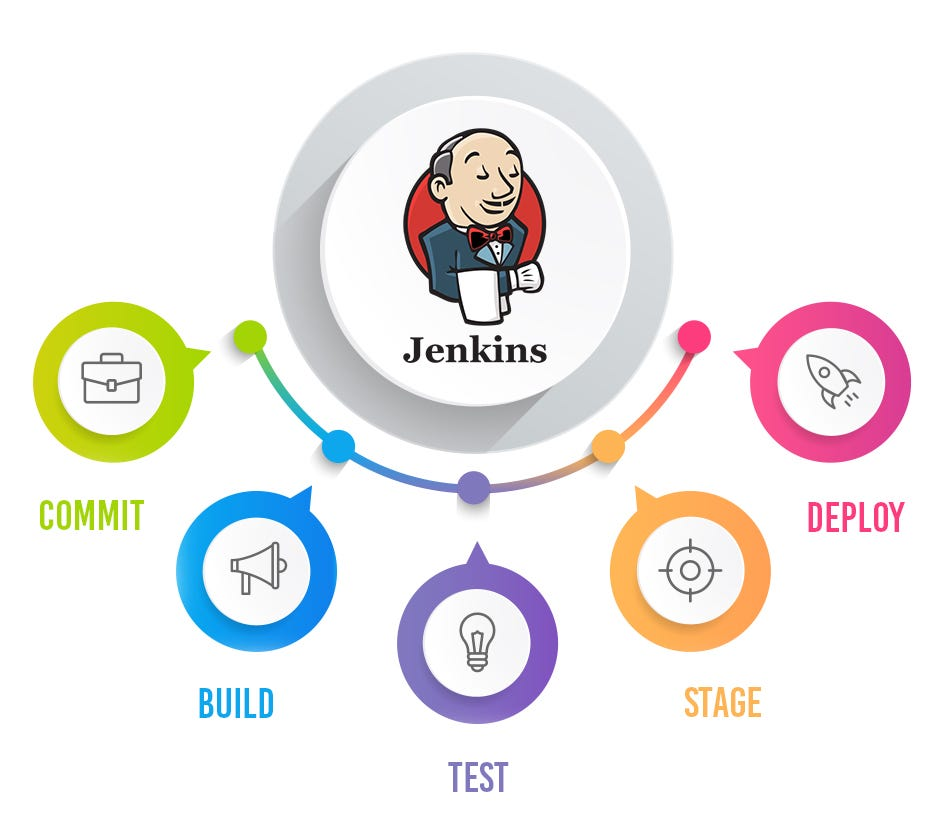

# À la découverte de Jenkins

## Introduction

**Jenkins** est un serveur d'intégration continue (CI) open source automatisé, utilisé pour orchestrer les phases de build, de test, et de déploiement dans les cycles de développement logiciel. Il est particulièrement prisé dans les environnements DevOps en raison de sa flexibilité, de sa compatibilité avec de nombreux outils et de son large écosystème de plugins.

---

## 1. Architecture de Jenkins

L'architecture de Jenkins est simple mais puissante, conçue pour être extensible et distribuée, permettant une automatisation robuste dans les environnements complexes.

### **Composants Clés :**
- **Jenkins Master** : Le serveur principal, responsable de la gestion des jobs, de la planification des tâches, de la distribution des tâches aux nœuds (agents), et de la gestion des résultats des builds. Il orchestre l'ensemble du pipeline.
- **Jenkins Agents (ou Slaves)** : Les nœuds distants exécutant les jobs sur différentes machines ou plateformes. Cela permet de distribuer la charge des builds sur plusieurs systèmes, améliorant la scalabilité et la performance.
- **Jenkins Executor** : Une instance dans chaque agent qui exécute un job. Chaque agent peut avoir plusieurs exécuteurs.

### Flux de Travail :
1. **Soumission du code** : Les développeurs poussent le code vers un dépôt (ex. : GitHub, GitLab).
2. **Trigger de Jenkins** : Jenkins est déclenché automatiquement par des événements comme un commit ou un pull request.
3. **Build et Test** : Jenkins déclenche le build, exécute les tests, et compile le projet.
4. **Reporting** : Jenkins collecte les résultats, génère des rapports et notifie les équipes en cas de succès ou d'échec.



---

## 2. Fonctionnalités de Jenkins

Jenkins offre un large éventail de fonctionnalités, en particulier pour les workflows CI/CD. Voici quelques-unes des principales :

### Automatisation des Builds
- Jenkins peut automatiser tout le processus de compilation du code, assurant que chaque commit ou changement déclenche une série de builds. Cela garantit que le code est testé régulièrement.

### Pipelines Jenkins
- Les pipelines définissent une série d'étapes que le code doit traverser, de la compilation au test en passant par le déploiement. Jenkins Pipelines peuvent être écrits sous forme de code (`Jenkinsfile`), ce qui permet de versionner les pipelines dans les dépôts de code source.

### Intégration avec des SCM (Source Control Management)
- Jenkins s'intègre avec des outils de gestion de versions comme Git, Subversion, Mercurial, etc., permettant de surveiller les dépôts pour les commits et de déclencher des jobs automatiques.

### Gestion des Notifications
- Jenkins peut envoyer des notifications par email, Slack, ou d'autres canaux pour informer les équipes des résultats de build, des erreurs, ou des réussites. Cela favorise la communication entre les équipes de développement et d'opérations.

### Builds Distribués
- Jenkins permet de distribuer les builds sur plusieurs agents, améliorant la performance et la résilience. Chaque agent peut être configuré pour exécuter des types de jobs spécifiques (par exemple, des builds spécifiques à des plateformes ou des tests).

---

## 3. Plugins Jenkins

L'une des principales forces de Jenkins est son écosystème de **plugins**. Jenkins propose des milliers de plugins qui étendent ses capacités pour répondre à presque tous les besoins en matière de CI/CD.

### Types de Plugins Courants :

- **Plugins SCM** : Pour s'intégrer avec des systèmes de gestion de versions comme Git, SVN, etc.
    - Exemple : **Git Plugin** pour la gestion des dépôts Git.

- **Plugins de Build** : Pour automatiser le build d'applications à l'aide d'outils comme Maven, Gradle, ou Ant.
    - Exemple : **Maven Integration Plugin** pour automatiser les builds Maven.

- **Plugins de Notification** : Pour envoyer des alertes via des services comme Slack, email, ou Microsoft Teams.
    - Exemple : **Slack Notification Plugin** pour intégrer les notifications dans les canaux Slack.

- **Plugins de Test** : Pour exécuter des tests automatisés avec des frameworks comme JUnit, TestNG, ou Selenium.
    - Exemple : **JUnit Plugin** pour générer des rapports de tests unitaires.

- **Plugins d'Intégration** : Pour s'intégrer avec des outils DevOps comme Docker, Kubernetes, Ansible, et Terraform.
    - Exemple : **Kubernetes Plugin** pour exécuter des jobs Jenkins dans un cluster Kubernetes.

---

## 4. Gestion des Pipelines Jenkins

### Pipelines Déclaratifs vs Pipelines Scriptés
Jenkins prend en charge deux types de pipelines : **Déclaratif** et **Scripté**.

- **Pipeline Déclaratif** : Le pipeline est défini avec une syntaxe simplifiée et plus accessible. Il est souvent utilisé car il est plus lisible pour des équipes larges.
    - Exemple :
    ```groovy
    pipeline {
      agent any
      stages {
        stage('Build') {
          steps {
            sh 'mvn clean package'
          }
        }
        stage('Test') {
          steps {
            sh 'mvn test'
          }
        }
      }
    }
    ```

- **Pipeline Scripté** : Offre plus de flexibilité et de contrôle, avec une syntaxe plus proche de Groovy. Il est souvent préféré pour les pipelines plus complexes.

### Jenkinsfile
Un **Jenkinsfile** est un fichier de pipeline stocké dans le dépôt de code source qui contient toutes les étapes du pipeline CI/CD. Cela permet de versionner et d'automatiser le processus de développement.

---

## 5. Sécurité dans Jenkins

### Gestion des Utilisateurs et des Rôles
Jenkins propose plusieurs niveaux d'autorisation, permettant de gérer qui peut accéder aux jobs, modifier les configurations ou exécuter des builds. Il supporte des systèmes d'authentification comme LDAP et OAuth.

### Durcissement de la Sécurité
- **API Tokens** : Jenkins utilise des jetons d'authentification API pour sécuriser les connexions entre les services.
- **Chiffrement des secrets** : Les credentials sensibles, comme les mots de passe et les clés API, peuvent être stockés de manière sécurisée dans Jenkins à l'aide du plugin **Credentials**.

### Sécurité des Plugins
Il est important de ne pas installer des plugins de sources non fiables, car ils peuvent introduire des vulnérabilités. Vérifiez toujours que vos plugins sont à jour.

---

## 6. Intégration de Jenkins avec Docker et Kubernetes

Jenkins s'intègre de manière fluide avec des environnements conteneurisés comme **Docker** et **Kubernetes**. Cela permet d'exécuter des jobs Jenkins dans des conteneurs, ce qui rend les builds plus légers, portables et isolés.

### Jenkins et Docker
- Jenkins peut utiliser Docker pour lancer des conteneurs comme agents de build. Cela garantit que les jobs sont exécutés dans un environnement propre et reproductible.
- Plugin **Docker Pipeline** : Pour gérer les builds et exécuter des tests dans des conteneurs Docker.

### Jenkins et Kubernetes
- **Kubernetes Plugin** : Ce plugin permet à Jenkins d'exécuter des jobs dans un cluster Kubernetes. Cela rend les pipelines hautement scalables et facilite la gestion des ressources.

---

## 7. Bonnes Pratiques avec Jenkins

### Maintenir un Jenkinsfile Clair et Versionné
- Le Jenkinsfile doit être stocké dans le dépôt de code source afin de suivre les modifications et assurer une collaboration efficace.

### Modulariser les Pipelines
- Séparez les étapes de build, test et déploiement dans des stages distincts pour plus de clarté et pour faciliter les erreurs de débogage.

### Utiliser des Notifications Automatisées
- Configurez des notifications automatiques pour informer les équipes en cas d'échec ou de succès des builds.

### Mettre à Jour Jenkins et les Plugins
- Assurez-vous que Jenkins et ses plugins sont à jour pour garantir la sécurité et les performances.

---

## Conclusion

Jenkins est un outil incontournable pour l'automatisation des processus CI/CD dans les environnements DevOps. Grâce à son architecture modulaire, son support des plugins, et sa capacité à s'intégrer avec des outils comme Docker et Kubernetes, Jenkins permet de construire, tester, et déployer des applications de manière automatisée et fiable.

En suivant les bonnes pratiques de sécurité, de pipeline, et de gestion des agents, vous pouvez tirer parti de Jenkins pour orchestrer des workflows DevOps complexes et garantir des livraisons continues avec un minimum d'interventions manuelles.
