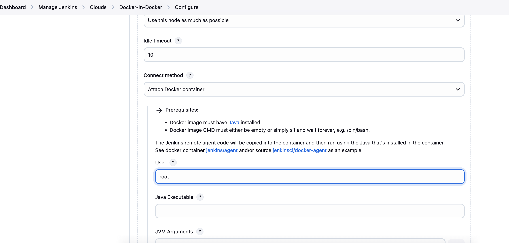
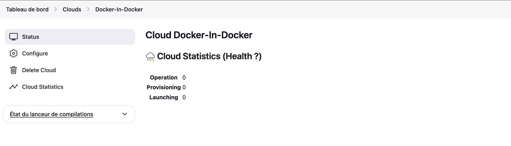
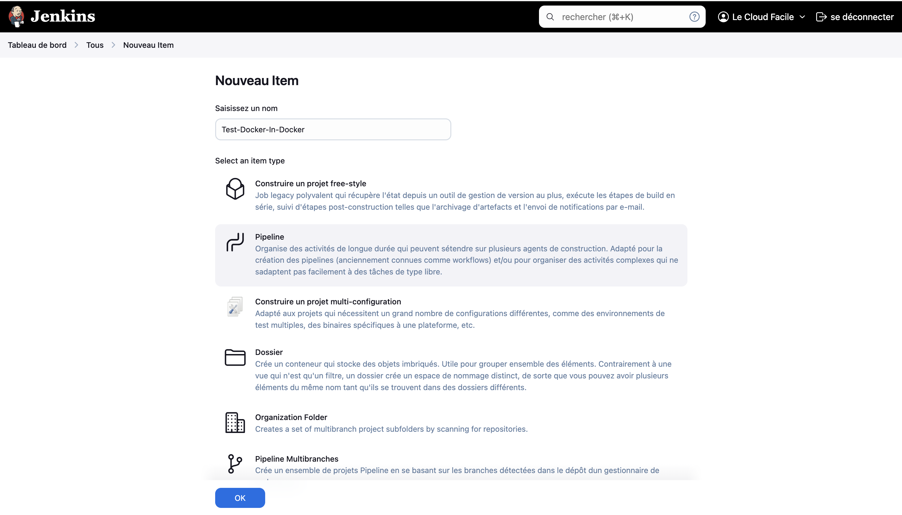

# LAB : Installation & Configuration Jenkins sur Docker 

## Présentation

### Objectifs: 

- Installation de Jenkins
- Configuration d'un agent cloud sur Jenkins
- Docker In Docker
- Création d'un pipeline basique pour tester les builds

### Prérequis

- Connaissance de Docker
- Instance docker fonctionnel
- Editeur de code
- Utilitaire installé sur la machine: git
- Avoir un proxy nginx fonctionnel (voir lab deploy reverse proxy sur la section 03-conteneurisation)


## Déroulement du Lab

### Etape 1 : Creation du manifeste docker compose
Dans cette étape, nous allons construire ensemble le manifeste docker-compose en commentant l'utilité de chaque instruction.

Tout d'abord, il faut créer un fichier docker-compose.yaml et mettre le contenu ci-après:

```yaml
# Indication de la version de l'API
version: '3.8'

# Création d'un volume nommé <jenkins-data> pour la persistance des données.

volumes:
  jenkins-data:
    name: jenkins-data

# Création d'un réseau nommé <jenkins-network> pour l'ensemble des conteneurs qui vont appartenir à la stack et déclaration du réseau <frontend> utilisé par le proxy nginx.

networks:
  jenkins-network:
    name: jenkins-network
  frontend:
    name: frontend
    external: true

# Déclaration liste des services
services:

  # Service jenkins: Instance Jenkins
  jenkins:

    # Choix de l'image
    image: jenkins/jenkins:jdk21

    # Nom du comteneur
    container_name: jenkins-dev

    # Attachement du service aux réseaux jenkins-network & frontend
    networks:
      - jenkins-network
      - frontend
    
    # Montage du volume pour la persitence des données et du socket docker pour autoriser le docker-in-docker
    volumes:
      - jenkins-data:/var/jenkins_home
      - /var/run/docker.sock:/var/run/docker.sock
    
    # Toujours forcer le rédémarrage du conteneur en cas de problème.
    restart: always

    # Activation du mode priviligié sur le conteneur
    privileged: true

    # Démarrage du conteneur en mode root
    user: root

```

### Etape 2: Execution des services

A ce stade, toutes les configurations sont finalisées. Il ne reste plus qu'à démarrer les services

- Démarrage des services

La commande ci-dessous permet de démarrer tous les services en arrière-plan.

```bash
docker compose up -d
```

- Affichage des conteneurs

```bash
docker ps -a  --filter name=jenkins
```

### Etape 2 : Récupération du code source

La commande suivante permet de récupérer le code source contenant les fichiers samples du proxy nginx. 

```bash
git clone https://github.com/wingufactory/lecloudfacile-devops-labs.git
```


### Etape 4: Mise à jour de la configuration du proxy

Le répertoire `lecloudfacile-devops-labs/nginx-proxy/conf.d/jenkins` contient un example de configuration du proxy  pour la gestion des requêtes entrantes en ce concerne l'application jenkins. Nous pourrons la copier dans le répertoire 
`lecloudfacile-devops-labs/nginx-proxy/conf.d` avec la bonne extension `.conf`
```bash
cd lecloudfacile-devops-labs/nginx-proxy/
cp conf.d/jenkins/jenkins.scratch.conf.template conf.d/jenkins.conf
```

Il faudra recharger la configuration du proxy pour prendre en compte les modifications apportées.

```bash
docker exec -ti proxy nginx -s reload
```

### Etape 5: Accès à l'application

Ouvrir un navigateur et taper l'adresse suivante : http://jenkins.lcf.io

### Etape 6: Finalisation de l'installation

1 - Récupérer du mot de passe initial
```bash
docker exec -ti jenkins cat /var/jenkins_home/secrets/initialAdminPassword
```

2 - Copier le mot de passe sur le champ `Administrator password` puis cliquer sur `continuer`


3 - Cliquer sur `Installer les plugins suggérés`


Un lot de plugin sera installé


4 - Créer le premier utilisateur comme suit


5 - Vérifier que `Jenkins URL` est bien positionné à `jenkins.lcf.io` puis cliquer sur `Save and Finish`


Une fenêtre vous indique que votre instance Jenkins est prête. Cliquer sur `Commencer à utiliser Jenkins`


Vous devez obtenir une vue similaire à la suivante


### Etape 7: Configuration agent Cloud

Jenkins recommande l'usage d'agent pour des builds distribués. Nous pouvons voir sur le message en cliquant sur l'icone de sécurité (voir image suivante). La procédure ci-après permet de configurer un agent Docker.

1- Cliquer sur le bouton `setup cloud`


2- Cliquer sur `Install a plugin`


Vous verrez la liste des providers disponibles


3- Cocher l'option `Docker` puis cliquer sur le bouton `Installer`


Vous pouvez apercevoir la progession de l'installation. N'oubliez pas de cocher l'option `Redémarrer Jenkins quand l'installation est terminée et qu'aucun job n'est en cours`


4- Après redémarrage, vous serez à nouveau rediriger vers la page de login. Veuillez vous authentifier


5- Après authentification, nous verrons une autre erreur indiquant la nécessité de ne pas programmer de build sur le master. Pour ce faire, cliquer sur le bouton `Manage`. 


6- Mettre `Nombre d'éxecuteurs` à `0` puis cliquer sur `Sauvegarder`


7- Le message warning disparait. Cliquer sur tableau de bord pour revenir à l'accueil


5- Sur la page d'acceuil, cliquer sur `Configure a cloud`


6- Cliquer sur `Nouveau cloud`


7- Entrer le nom `Docker-In-Docker` puis cocher Type `Docker` et cliquer sur `Create`


vous aurez une vue similaire à a suivante:


8- Configurer la section `Docker Cloud Details`
- Dépiler sur `Docker Cloud Details`
- Renseigner `\var\run\docker.socker` dans `Docker Host URI`
- Cocher `Enabled`
- Cliquer sur le bouton `Test Connection`


8- Configurer la section `Docker Agent Template`
- Dépiler `Docker Agent Template`
- Cliquer sur `Add Docker Template`


- Renseigner `inbound-agent` dans les champs `Name`et `Labels``
- Cocher le champ `Enbaled`
- Renseigner `lecloudfacile/inbound-agent:1.0.0` dans le champ `Docker Image`


- Dépiler Container settings 
- Renseigner `root` dans le champ `User`
- Renseigner `type=bind,src=/var/run/docker.sock,dst=/var/run/docker.sock` dans le champ `Mounts`


- Scroller vers le bas
- Choisir `Attach Docker Container` dans le champ `Connect method`
- Renseigner `root` dans `User`
- Cliquer sur `Save` pour enregistrer


Une fois enregistré, vous pouvez voir les détails de l'agent. Merci de cliquer sur `Tableau de bord` pour revenir à l'accueil



### Etape 6: Création d'un pipeline pour tester Docker-In-Docker

1 - Cliquer sur `New Item`


2- Renseigner le nom du pipeline `Test Docker-In-Docker`, selectionner `Pipeline` puis cliquer sur `OK`.



3 - Scroller vers le bas et mettre le code ci-après dans la section `Script`

```jenkins
pipeline {
    agent any

    stages {
        stage('Hello') {
            steps {
                sh 'docker ps'
            }
        }
    }
}
```

Comme sur la figure ci-dessous


- Cliquer sur `lancer un build` pour l'execution du pipeline


- Cliquer sur l'icone bleu avec `...` sur la section `Builds` pour afficher la sortie de l'execution du pipeline


- Nous voyons que l'execution du pipeline s'est effectuée avec succès.


