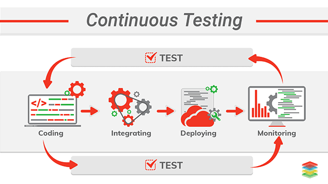
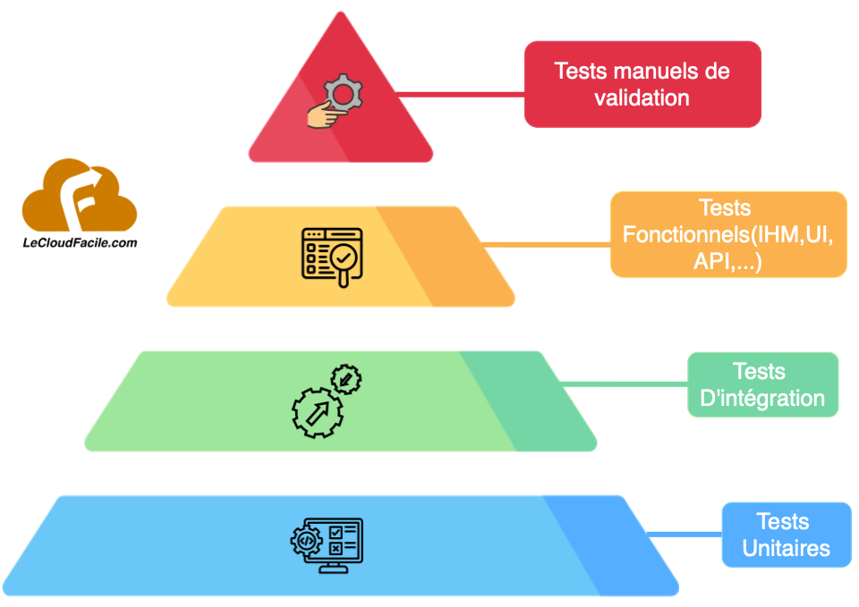
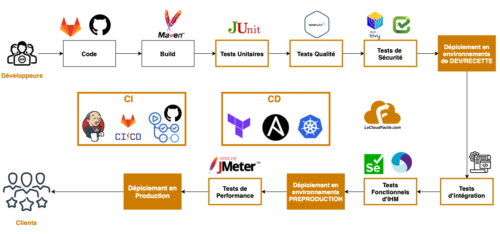

# Présentation des tests continus

## Objectifs

- Comprendre le fonctionnement du test continu
- Comprendre les différents types de tests
- Connaitre quelques outils de tests continus

## Sommaire

- Concept de Tests Continus

- Différents types de tests

- Pipeline de tests continus

## Concept de Tests Continus

On a pu voir précédemment comment déployer de façon automatisé une application avec la pratique de l'intégration continue. Cette pratique nous permet de pouvoir rapidement intégrer et déployer notre produit en quelques minutes tout en assurant une certaine consistance et cohérence à travers les différentes étapes de code, build, release et déploiement. 
Dans cette partie, il s'agira de mieux expliciter le concept de tests continus qui est aussi une étape cruciale dans le cadre de la mise en oeuvre d'un pipeline d'intégration et de déploiement continu. 
 
Dans le cycle de vie d'une application, les scénarios de tests occupent une place centrale et générent beaucoup d'efforts et de temps consommé. On sait tous qu'un code non testé n'a aucun sens, ainsi un pipeline sans des étapes de test est également un pipeline sans utilité. 
De ce fait les développeurs, testeurs et opérationnels implémentent différentes stratégies de tests pour s'assurer que le produit répond bien aux critères de qualité, sécurité, performance et exigences métiers. 
Le produit passe ainsi sur différents environnements (test, recette, pré-production,...) pour y subir une batterie de tests.
 

Dans le cadre de la méthodologie DevOps et plus précisément dans le cadre de la mise en pratique du CI-CD, l'ensemble de ces tests est fait de façon continu et totalement automatisé pour permettre une meilleure rapidité, fluidité et consistence dans la livraison de nos applications. 
Ainsi un ensemble d'outils de testing automatisés sont utilisés afin d'assurer une livraison automatisé d'un produit testé et validé de bout en bout. 

## Différents types de tests

Dans un contexte agile, on va retrouver en général cette pyramide classique de tests.

En commencant par le bas, on va retrouver :

- des **tests unitaires**, dont l'objectif est d'isoler une partie du code et tester son comportement en fonction de tout facteur externe et valider ainsi sa conformité aux attentes. Lors de ce test, des classes de test sont générées pour tester chaque partie du code
- des **tests d'intégration** dont l'objectif est de tester indépendamment chaque module de notre application afin de vérifier son bon fonctionnement avec les autres services et applications de notre entreprise. Par exemple, si notre application a besoin d'une base de données, d'un serveur web ou d'autres applications internes et externes, nous testerons l'intégration avec ces applications.
- des **tests fonctionnels** dont l'objectif est de tester et valider le fonctionnement de notre application et s'assurer qu'il remplit bien les fonctionnalités telles que décrites dans le cahier des charges fonctionnel. On y retrouvera des tests d'IHM, d'API, pour valider le comportement des utilisateurs de l'application.
- Enfin des **test manuels** de validation peuvent etre effectuer à la fin pour valider le fonctionnement global de l'application

Historiquement, dans la plupart des entreprises, excepté en général les tests unitaires qui peuvent etre codés, les autres tests sont en général effectués manuellement et sont consommatrice de beaucoup de temps et d'efforts.  
De ce fait, pour profiter pleinement des bénéfices du CICD, nous nous devons d'assurer une meilleure automatisation de ces phases de tests avec le principe du test continu.  
Et pour ce faire :

- L'effort d'automatisation doit etre mis en particulier sur les niveaux bas de la pyramide dans le but de détecter au plus tot les anomalies
- Les validations manuelles de tests doivent etre limitées au maximum et uniquement sur les éléments clé (car ils ralentissent grandement le process)
- Les tests doivent etre accomplis au plus tot de la chaine de pipeline CI-CD (**Shift Left**)

## Pipeline de Tests continus

Dans le cadre d'un pipeline de tests continus, on peut retrouver ces différents tests ci-dessous ainsi que les outils utilisés pour chaque phase dans l'ordre:

- **Tests unitaires** : Des outils comme *Junit* (Java), *PHPUnit* (PHP), *PyUnit* (Python) peuvent etre utilisés
- **Tests de Qualité** : Des outils comme *SonarQube* peuvent tester la qualité du code (déduplication, performance, securité, maintenabilité, longueur,...), générer des rapports et recommandations. On peut mettre en place des "Quality Gates" qui bloqueront le pipeline CI-CD si certaines exigences ne sont pas remplies
- **Tests de sécurité** : Des outils comme *Burp*, *Checkmarx*, *Trivy*, *Snyk* peuvent etre utilisés pour détecter les vulnérabilités dans le code ou dans certains composants
- **Tests d'intégration** : La plupart du temps des scripts en fonction du contexte peuvent etre utilisés (ou de façon manuel) pour valider l'intégration de nos modules avec le reste des applications de l'entreprise
- **Tests fonctionnels** : Des outils comme *Selenium*, *Cucumber*, *Appium* peuvent etre utiliser pour simuler le comportement d'un utilisateur sur notre application et valider ainsi l'expérience utilisateur (tests IHM, UI, API,...)
- **Tests de performance** : Des outils comme *Octoperf*, *Instana*, *Apache JMeter* sont utilisés pour effectuer des tests de charge et valider la performance de notre système en cas de forte affluence 

Ci-dessous on peut retrouver un exemple de pipeline de tests continus entièrement automatisé de bout en bout en prenant en exemple une application développée en Java:

## Conclusion

On a pu voir dans ce chapitre qu'un bon pipeline CI-CD automatisé de bout en bout repose également sur un choix judicieux des principales étapes de tests à automatiser. 
On pourra voir par la suite comment implémenter plus concrètement ces différentes techniques de tests dans notre pipeline CI-CD. 
