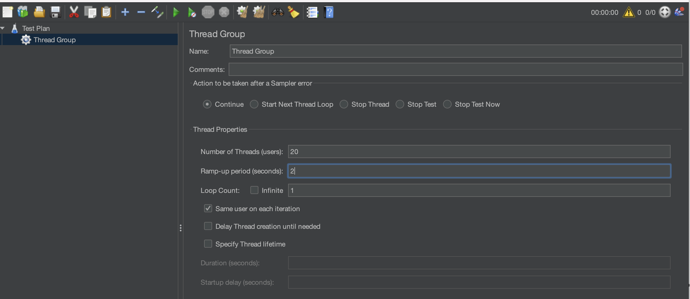
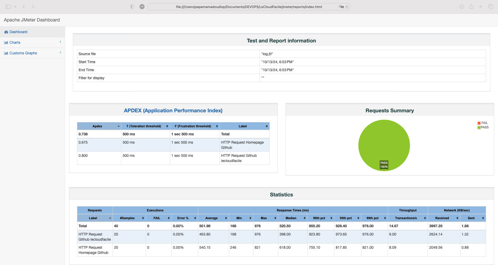
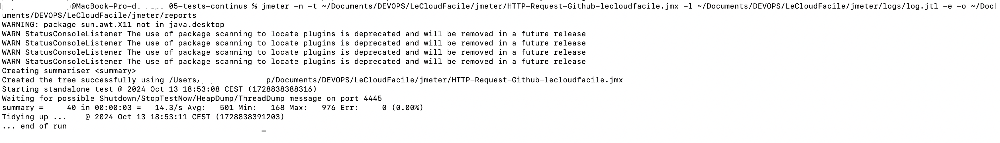

# Les tests de performance avec Jmeter

## Objectifs

- Comprendre le fonctionnement des tests de performance avec l'outil Apache Jmeter  
- Connaitre et découvrir l'utilisation de Jmeter  

## Sommaire

- Présentation

- Architecture et principaux composants

- Différents types d'execution de tests avec Jmeter

- Utilisation de Jmeter dans un pipeline CI/CD

## Présentation
  

Apache Jmeter est un outil Open-source, développé en Java par la fondation Apache,  qui permet de lancer différents types de tests pour mesurer le comportement d'une application web (qu'elle soit statique ou dynamique) tels que :  
- des tests de *performance* : s'assurer que notre application remplit les critères de performance et de qualité établis  
- des test de *charge* : s'assurer que le système accueillant notre application est capable de supporter la charge prévue. Il permet de comprndre quelle charge le système peut tolèrer  
- des *stress test* : Observer comment le système se comporte sous une charge supérieure à la capacité maximale prévue et jusqu'à quel niveau notre système s'arrète de fonctionnter sous cette charge  
- des test *fonctionnels* : s'assurer que les caractéristques et fonctionnalités de notre système correspond bien à ce qui est attendu du coté utilisateur

Il peut être utilisé pour simuler une charge importante sur un serveur, un groupe de serveurs, un réseau ou un objet afin de tester sa résistance ou d'analyser les performances globales sous différents types de charge. 
Il est particulièrement important dans le cycle de développement d'une application car elle permet de valider le comportement et la performance de notre système en cas de forte affluence.  

## Architecture et principaux composants
Apache Jmeter effectue les tests de performance en simulant un groupe d'utilisateurs(threads) envoyant des requetes sur un serveur cible puis retourne les résultats statistiques sous différents formes (diagrammes, tableaux,...)  

### Architecture

Plusieurs types d'architecture existent en fonction si on veut effectuer des tests depuis l'interface webi (en mode GUI), en mode CLI (Non-Gui mode) ou en mode distribué. Cependant de façon général, l'archicture est telle que décrite ci-dessous :  

### Principaux composants

Jmeter une application avec une interface graphique pouvant fonctionner sur tout environnement ou poste de travail ayant Java d'installé : Windows, Linux, MacOS,...                   
Son installation et utilisation est facile à prendre en main. Il est capable d'effectuer des tests sur plusieurs types d'applications et protocoles :

- **Web** : HTTP, HTTPS pour des sites développés en Java, NodeJS PHP, ASP.NET,...
- **WebServices** : REST, SOAP
- **Base de données** via les pilotes JDBC
- **Annuaires** : LDAP
- **Messagerie orientée service (middleware)** via JMS
- **Services de messagerie** : POP3(S), IMAP(S), SMTP(S)
- **Service FTP**
- **TCP**  
etc..

Parmi les principaux composants de Jmeter, on peut retrouver :  
- une interface graphique (IDE) permettant de pouvoir rapidement créer un plan de test et le tester  
- une éxècution en mode CLI (Non-GUI mode ou headless mode) pour faire des tests de charge depuis n'importe quel système d'exploitation compatible avec JAVA  
- un générateur de dashboard pour permettre de visualiser graphiquement le résultats des tests  
- un fonctionnement en mode multi-threads (Groupe de Threads) permettant de lancer plusieurs requetes concurrentes durant notre test de charge ou bien d'avoir des paliers de tests. Ce fonctionnement permet de simuler des utilisateurs virtuels pour nos tirs de charge (un thead correspond à un utilisateur virtuel)
- des listeners (ou récepteurs) qui permettent de capturer les réponses du serveur cible à tester et les enregistrer sous formes de tableaux, graphiques, etc..
- des injecteurs permettant de simuler les tests de chzrge tout en le répartissant sur plusieurs machines distantes afin d'éviter de saturer notre poste de travail ou le serveur depuis lequel on veut lancer les tests.

A cela on peut ajouter plusieurs extensions possibles pour effectuer des tests encore plus poussés en fonction de notre contexte.

**Exemples de configuration pour lancer tests de charge depuis l'interface de Jmeter**

**Exemple de résultats**

## Différents types d'éxecution de tests avec Jmeter

L'utilisation de Jmeter pour nos tests de performance peut etre effectuée de plusieurs manières :  

- en mode **GUI** (interface graphique) : Dans cette méthode, Jmeter vous permet (comme montré précedemment) de confgurer et lancer les tests depuis l'interface graphique qu'elle propose. L'avantage est une prise en main rapide pour la création de notre plan et de sa validation. la sauvearde de notre plan de tests génèrera un fichier de configuration en mode .jmx qui contient l'ensemble de la configuration de notre plan de tests qui pourrait etre utilisé sur les autres modes d'éxecution suivantes. Ce mode peut etre lancé directement depuis notre poste de travail (windows, macOS ou linux graphique).  
D'ailleurs ce mode n'est pas recommendé car il pourrait mener à des problèmes de performance lors des tests  

- en mode **Non-GUI** (CLI) : Dans ce mode, Jmeter est lancé en mode CLI (ligne de commande). Jmeter execute nos plans de tests sans l'interface graphique et sauvegarde nos résultats en format (CSV, json, XML, html,...). Ce mode est très utile pour automatiser les scénarios de test ou effectuer des tests à grande échelle tels que des tests de charge.  

- en mode **distribué** : ce mode est utilisé pour lancer des tests de charge distribués en utilisant d'autres machines. 
Un noeud joue le role de controleur pour contenir la configuration et orchestrer le lancement des tests, récupèrer les résultats et génèrer les rapports
D'autres noeuds qui jouent le roles de worker (ou d'injecteur) qui se chargent d'executer les tests selon le plan défini par le controleur

## Utilisation de Jmeter dans un pipeline CI/CD

Apache Jmeter rentre facilement dans le cadre d'un pipeline d'intégration et de déploiement ou livraison continu pour apporte plus d'assurance et d'automatisation dans notre cycle de déploiement de nos applications.  
Il existe plusieurs intégration et plusgins avec des outils comme GitHuh, Jenkins, Maven, Gradle, etc..  

Exemple d'intégration via un plugin sur jenkins :

Il peut aussi facilement s'intégrer dans des scripts Github ou Gitlab via son exéction en mode CLI.

# Conclusion

On a pu voir ensemble le principe de fonctionnement d'Apache Jmeter et son importance dans le cadre de la mise en place d'une philosiphie DevOPs.  
Maintenant nous allons voir comment mettre en place et configurer Jmeter de façon plus pratique.  
