# LAB : Création d'un scénario de test de charge avec Jmeter

**🕘 : 40 minutes**

## Présentation

Dans ce lab, on va voir ensemble comment créer et dérouler un scénario de test de charge avec Jmeter en mode GUI (interface visuelle) et CLI (ligne de terminal)

### Objectifs

- Installation de Jmeter
- Création et lancement d'un scénario de test de charge depuis la GUI
- Lancement d'un test de charge en ligne de terminal (CLI)

### Prerequis

- Etre sur un windows, macOs ou une distribution linux avec interface graphique
- Avoir java (à partir de la version 8 et plus) d'installé sur son poste

Pour *Windows* -> https://www.guru99.com/install-java.html <br> 
Pour *MacOS*   -> https://tejaksha-k.medium.com/a-step-by-step-guide-to-installing-java-on-macos-5188bfdf99d7 <br>
Pour *Linux*   -> https://www.java.com/fr/download/help/linux_x64_install.html  

## Déroulement du Lab

### Etape 1 : Vérification de l'installation de Java

Ouvrir un terminal et lancer la commande ci-dessous pour vérifier que Java est bien installé sur son poste

```sh
java -version
```

Si java non installé, suivre les documentations dans la partie pré-requis pour installer java selon le système d'exploitation utilisé.
Ensuite vérifier si la variable `JAVA_HOME` est bien configuré si on est sur macos ou sur linux    
```sh
echo $JAVA_HOME
``` 


### Etape 2 : Téléchargement et installation de Jmeter

- Sur Windows ou linux avec interface graphique

Télécharger le package officiel (.zip ou .tgz) de Jmeter depuis ce lien --> https://jmeter.apache.org/download_jmeter.cgi

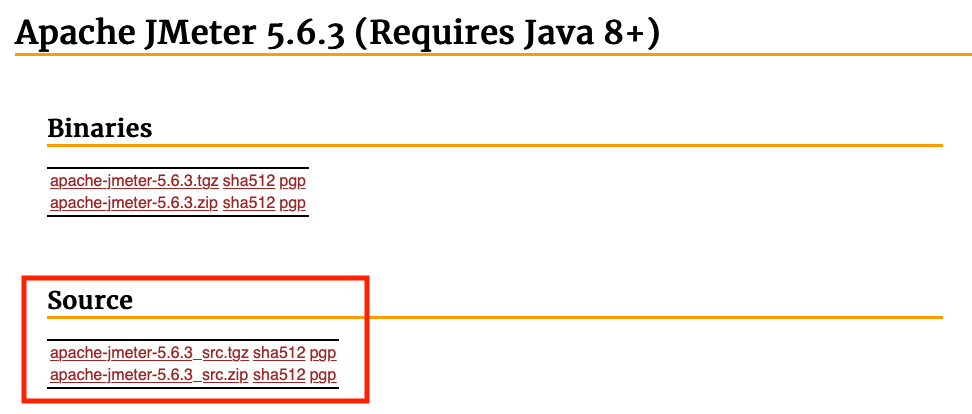


Puis décompresser le dossier .zip ou .tar.gz

- Sur MacOs, ouvrir un terminal

Installer `brew` si ce n'est pas encore le cas  
```sh
/bin/bash -c "$(curl -fsSL https://raw.githubusercontent.com/Homebrew/install/HEAD/install.sh)"
```
Installer `Jmeter`  
```sh
brew install jmeter
```

Vérifier si l'installation s'est bien déroulée
```sh
jmeter -v
```

### Etape 3: Lancement de Jmeter en mode GUI
- sur Windows ou linux, une fois le dossier décompressé, se rendre dans le répertoire `bin` du dossier jmeter et lancer le programme `jmeter` (windows batch file)
- sur macOS, ouvrir un terminal et lancer la commande :
```sh
jmeter
```

L'interface d'Apache jmeter se lance et apparaitra comme ci-dessous :

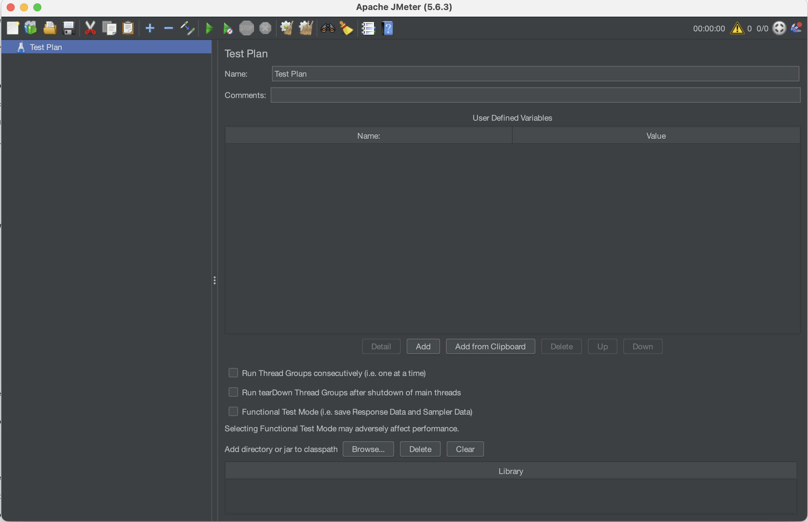  

### Etape 4: Création d'un scénario de test de charge depuis la GUI de Jmeter

Maintenant on va créer et configurer notre scénario de test de charge vers une application web.
On va prendre comme scénario, un test de charge de 20 utilisateurs sur le site github qui héberge nos labs de cloudfacile -> https://github.com/wingufactory/lecloudfacile-devops-labs

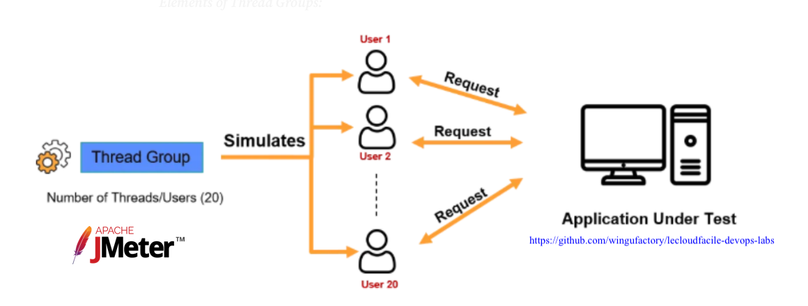

- Ajout d'un groupe de Threads (groupe d'utilisateurs) au plan de test pour configurer le nombre d'utilisateurs nécessaires pour le test de charge
```sh
Clic-droit sur le plan -> Add -> Thread (Users) -> Thread Group.
```

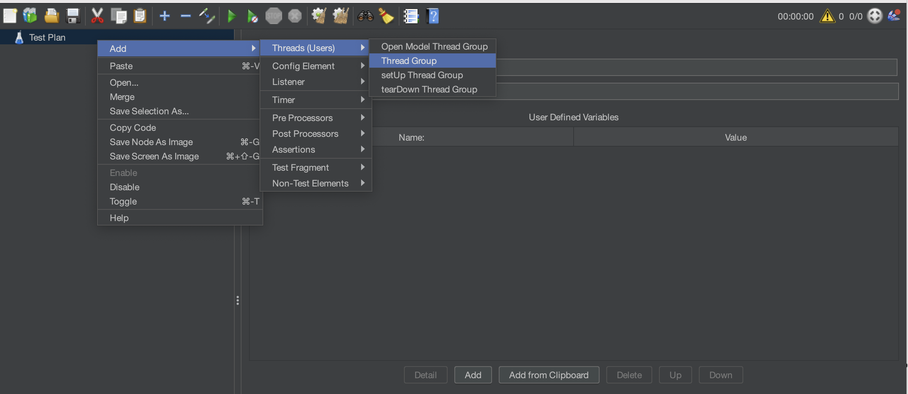 

- Configuration des threads

`Number of Threads (users)=20` : nombre d'utlisateurs à simuler pour notre test de charge <br>
`ramp-up period(seconds)=2` : nombre de secondes que nos 20 utilisateurs vont passer pour rentrer dans le système (durée de montée de charge). Supposons que les applications que nous proposons dans notre test doivent être testées pour 10000 utilisateurs. Il n'est pas très réaliste de laisser les 10000 utilisateurs entrer dans le système en même temps. Le temps de montée en puissance détermine le nombre de secondes pendant lesquelles 10000 utilisateurs seront inclus dans le système par l'outil de test. Dans notre exemple, la valeur de 2 secondes veut dire que nos 20 utilisateurs vont mettre 2s à rentrer dans le système (donc vont effectuer une action sur le site cible à tester), ce qui fait qu'on aura 10 utilisareurs dans le système par seconde. si on n'avait mis le nombres de threads à 10000 et ramp-up à 20 secondes, Jmeter simulera 500 utilisateurs par seconde pour avoir 10000 utilisateurs actifs à la fin de ces 20 secondes. <br>
`Loop count=1` : nombre d'itérations de ce meme test. Si cette valeur était par exemple à *2*, à la fin de notre premier cycle de tests de 20 utilisateurs, le système continuera une seconde fois pour faire rentrer encore 20 autres utilisateurs dans le système  

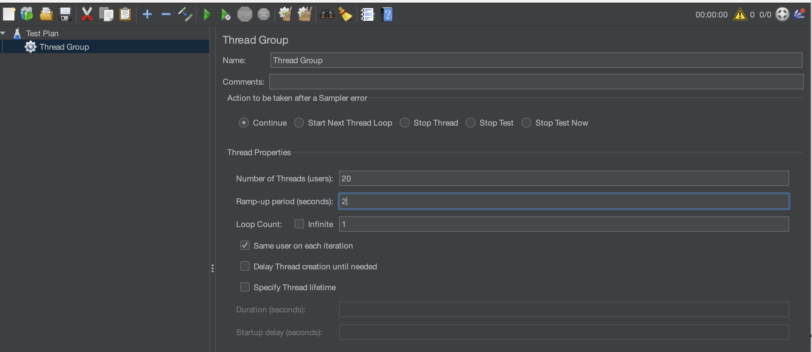

- Ajout d'un sampler (type de requête)
Ensuite on va rajouter une requête de type HTTP (sampler HTTP). Ce sampler nous permet d'envoyer des requêtes HTTP/HTTPS vers un serveur web  

```sh
Clic-droit sur Thread Group -> Add -> Sampler -> HTTP Request
```

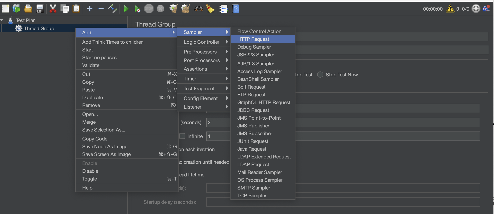

- Configuration du sampler HTTP Request  

`Name` : Nom du sampler HTTP Request  
`Comments` : Description  
`Protocol` : protocole d'écoute de l'application web cible. Dans notre cas *HTTPS*  
`Server Name or Ip` : url cible de l'application à tester. dans notre cas *github.com*  

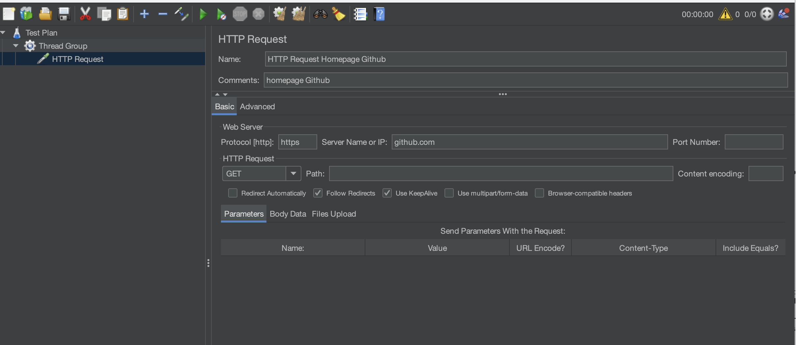

On peut rajouter un autre sampler de requête HTTP pour aller faire un stress test sur la page contenant nos labs (wingufactory/lecloudfacile-devops-labs) avec les infos ci-dessous :

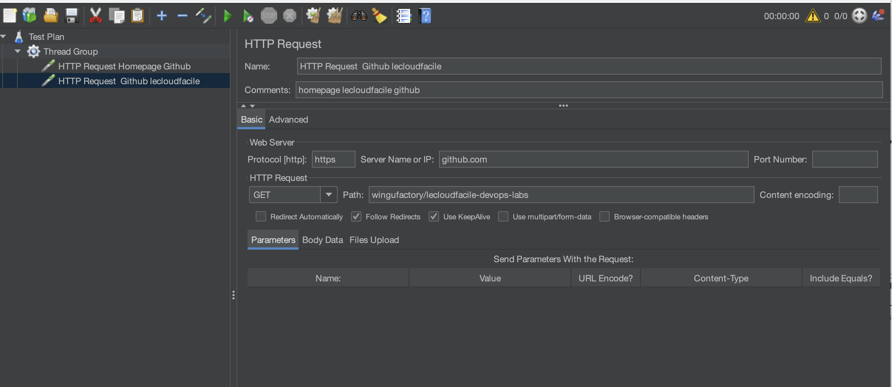


- Ajout d'un listener
Pour récupérer et afficher les résulats de notre test de charge, il faudra rajouter un ou plusieurs *listener*. Plusieurs formats sont proposés : sommaire en forme de tableau, graphe, fichier de log,...

```sh
Clic-droit sur Thread Group -> Add -> Sampler -> HTTP Request
```

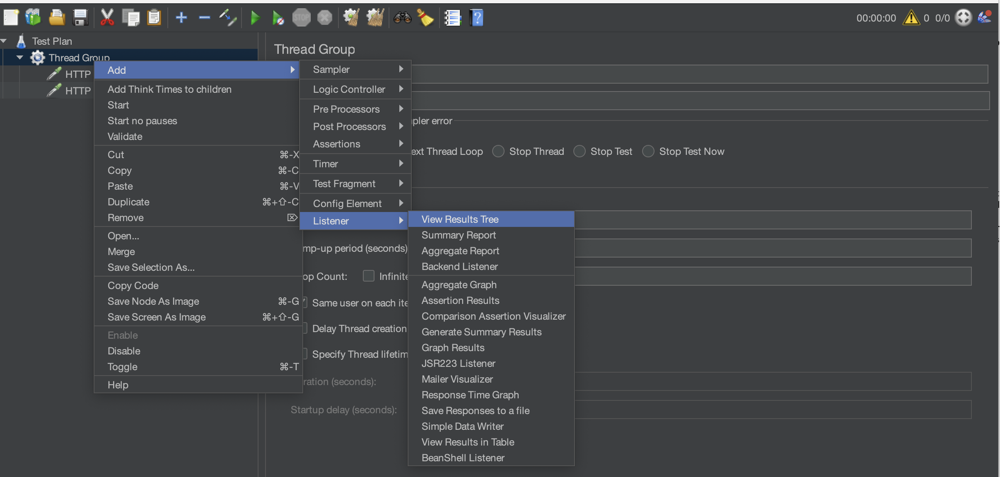


Dans notre exemple, on va rajouter ces listeners suivants : 

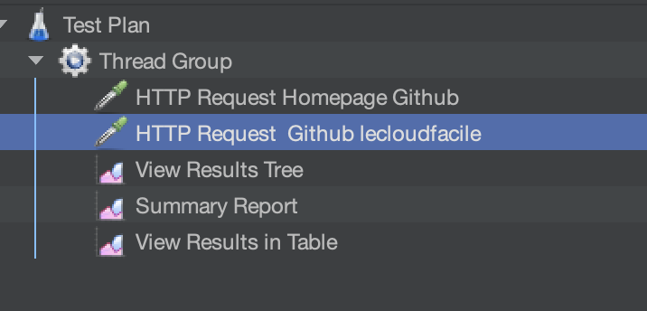

- Sauvegarder notre plan de tests

Enfin cliquer sur l'icone de sauvegarde tout en haut à gauche pour sauvegarder notre plan de test 

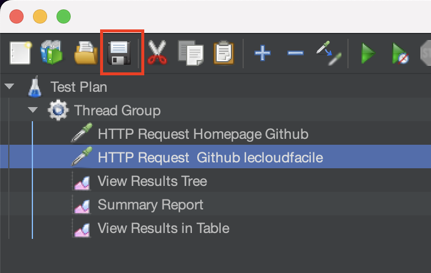

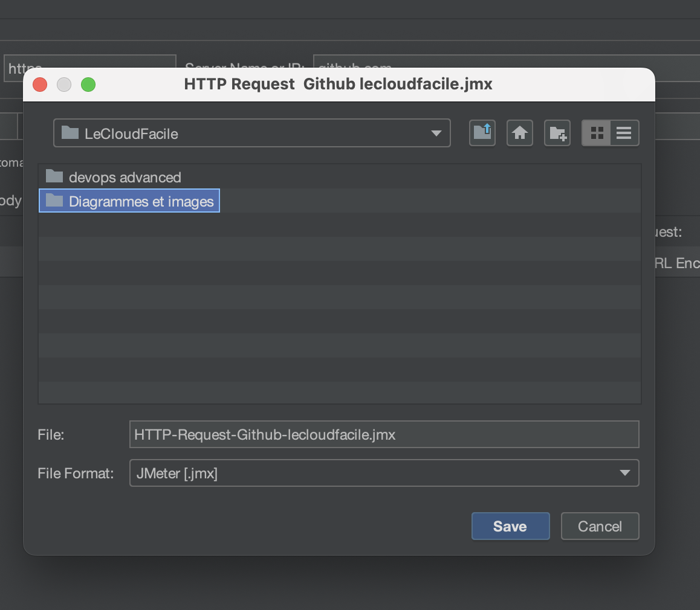

La sauvegarde générera un fichier de type `.jmx` qui nous sera utile lors de l'étape 7 de ce lab

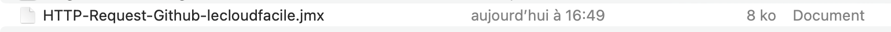

### Etape 5: Lancement du test de charge depuis la GUI de Jmeter

Une fois le plan sauvegardé, on peut désormais lancer nos tests de charge depuis la GUI de Jmeter en cliquant sur le bouton *play* situé en haut de la barre d'outils

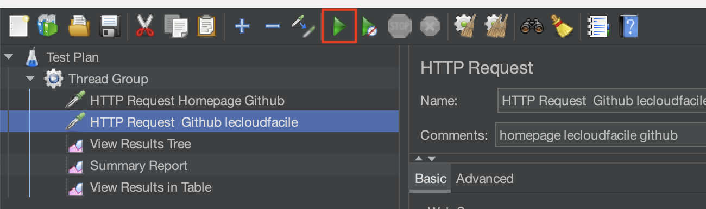


### Etape 6 : Présentation et analyse des résultats

Au niveau des listeners, on pourra visualiser le résultat de nos tests

- `View result tree`

Pour chaque requête de tests lancée, on peut voir le statut (succès ou echec) et les résultats en détails des envois et réponses du serveur cible

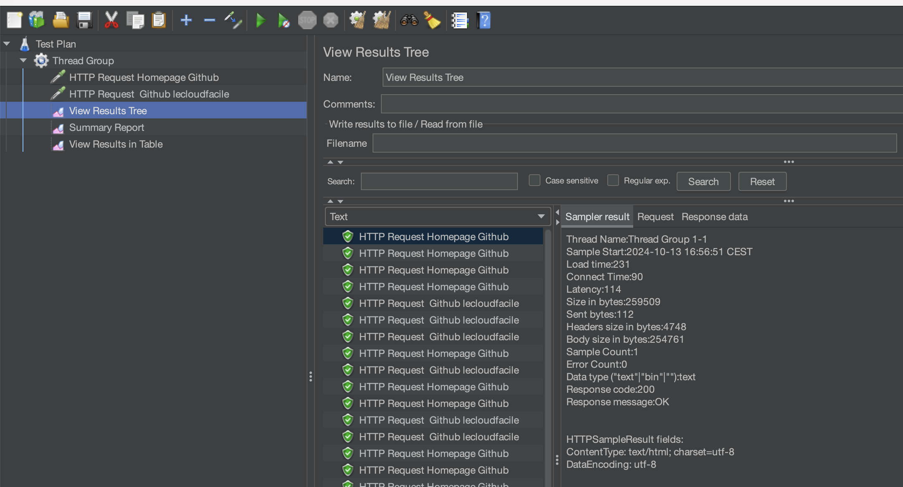

- `View result in table`

Memes infos que le result tree sous format tableau. On peut voir le temps de connection de chaque requête, son temps de charge, les latence,..

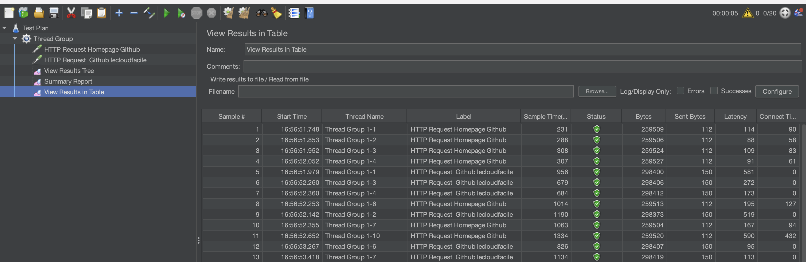

- `Summary Report`

On peut y retrouver un résumé codensé des résultats de nos tests sous forme de tableau (le load time, % d'erreurs, nombre de paquets envoyés par secondes,...)

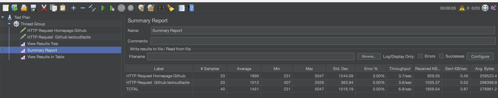


### Etape 7 : Lancement du test de charge Jmeter en mode CLI

Même si le lancement en mode GUI peut répondre à notre besoin de test de charge de façon simple et plutot facile à prendre en main, cela n'est cependant pas la manière recommandée par Jmeter pour lancer des tests de charge.  
En effet ce mode, non recommendé par l'éditeur, peut présenter des problèmes de performance lorsqu'on est dans un vrai scénario de test en entreprise et ne correspond également pas à nos besoins d'automatisation dans un contexte DevOps.    
Ce mode GUI ne doit servir que pour la création d'un premier plan de test pour nous permettre de générer le fichier `.jmx` qui contient toute la configuration de notre plan de test et pourra ainsi nous servir lors du lancement des tests de charge en mode CLI.

- Suppression les listeners

```sh
Clic-droit sur le listener -> remove
```

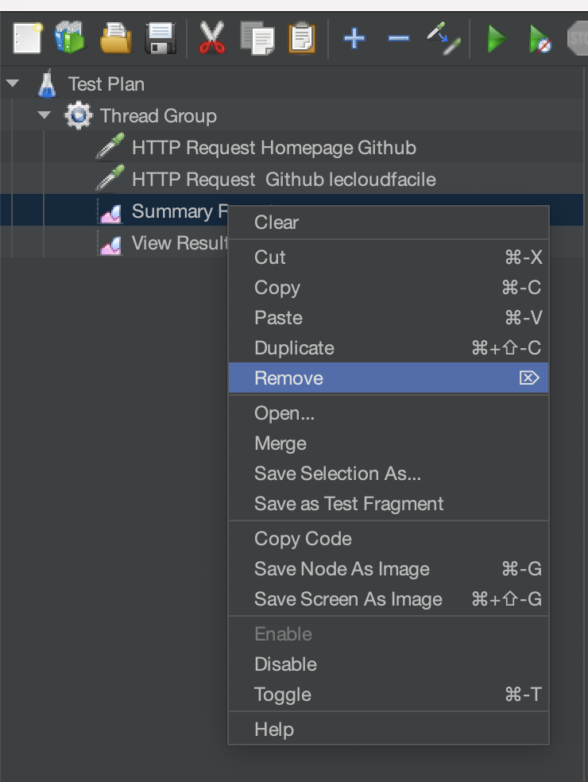

Ensuite sauvegarder pour mettre à jour notre fichier `HTTP-Request-Github-lecloudfacile.jmx` 

- Création de dossiers vides pour accueillir les résulats

Vous pouvez créer un nouveau dossier appelé *Jmeter* où dedans vous pouvez mettre votre fichier *.jmx* 
Dans ce meme dossier où est sauvegardé votre .jmx file, créer deux sous-dossiers vides : `reports` et `logs`  

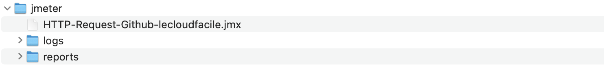


- Lancement en mode CLI

Sur Windows et distribution Linux, ouvrir un terminal et se rendre sur le dossier `bin` de apache-jmeter
Sur macOs, avec l'installation de jmeter suite à la commande `brew`, il n'est pas la peine de se rendre dans un dossier particulier. Il suffit juste d'ouvrir un terminal.  
Ensuite lancer cette commande ci-dessous :  

```sh
jmeter -n -t ~/Documents/DEVOPS/LeCloudFacile/jmeter/HTTP-Request-Github-lecloudfacile.jmx -l ~/Documents/DEVOPS/LeCloudFacile/jmeter/logs/log.jtl -e -o ~/Documents/DEVOPS/LeCloudFacile/jmeter/reports 
```

*P.S* : Adapter les chemins en fonction du système d'exploitation

`-n` : dire à jmeter de d'executer en mode cli et non en mode GUI  
`-t` : nom du fichier JMX qui contient la configuration de notre plan de test  
`-l` : nom du fichier de log pour sauvegarder les résulats  
`-e` : spécifier à jmeter de générer un rapport à la fin des tests  
`-o` : dossier pour sauvegarder les rapports de tests. Ce dossier ne doit pas exister ou doit être vide  


- Visualisation des résultats

Jmeter va génèrer, dans le dossier `reports`, un ensemble de fichiers avec le résulat de nos tests en format HTML  
Double-cliquer sur le fichier `index.html` pour les visualiser  

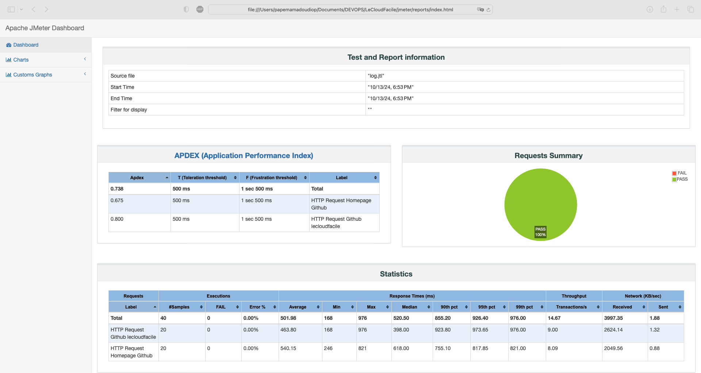

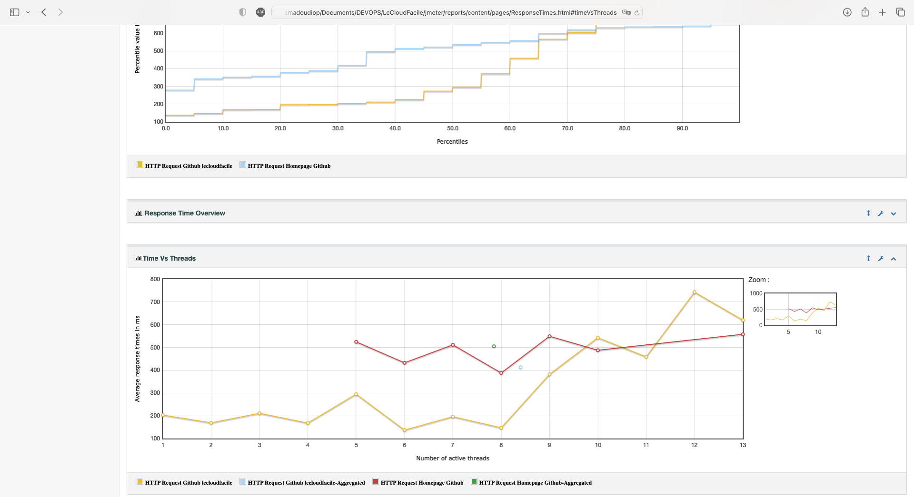


## Réfèrences

https://jmeter.apache.org/usermanual/get-started.html  
https://medium.com/bosphorusiss/performance-and-load-testing-with-jmeter-c340dfa0f1cf  

## Conclusion

Dans ce lab on a pu voir ensemble comment lancer des tests de charge avec l'outil Apache Jmeter en mode GUI et en mode CLI qui peut bien répondre à nos besoin de tests de charge.  
Cependant dans un réel contexte d'entreprise et mise en oeuvre de pratiques DevOps, il sera indispensable d'aporter plus d'automatisation à cette méthode en utilisant notamment le principe de la conteneurisation.  
Ce qu'on va découvrir dans le prochain Lab.  
