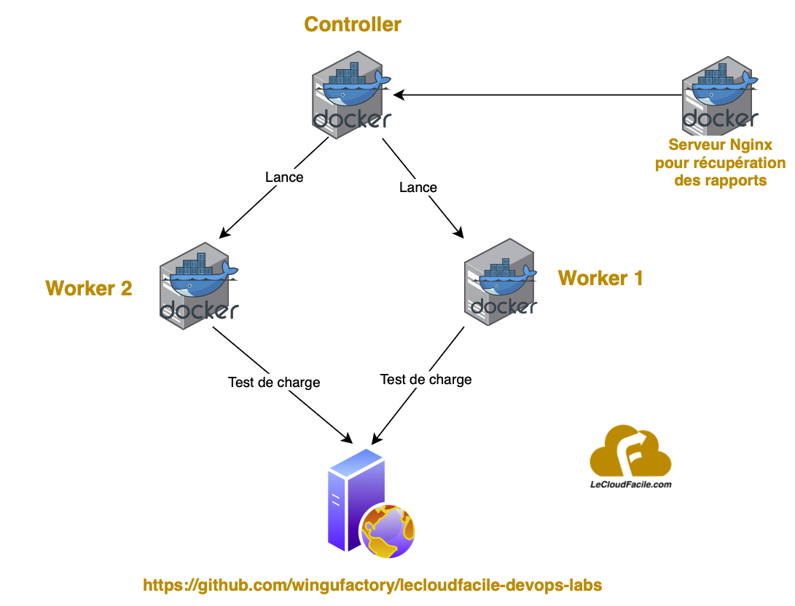

# LAB : Création d'un test de charge Jmeter distribué avec Docker pour une application web

**🕘 : 25 minutes**

## Présentation

Dans ce lab, on va voir ensemble comment lancer des tests de charge avec Jmeter avec la mise en place d'une architecture distribuée sous Docker.  
En effet, si on essaye de faire des tirs de charges avec un très grand nombre d'utilisateurs virtuels sur une meme machine, on risque d'avoir une saturation des ressources de notre machine.  
C'est pour cela, on va simuler le test de charge effectué sur le lab précédent en utilisant cette fois ci une architecture distribuée avec l'aide de Docker.
On aura une architecture avec 4 conteneurs :  
- 1 conteneur en tant que *controleur* : il sera en charge d'executer les tirs de charge et controler les worker (ou injecteurs) distantes qui participeront à ce test  
- 2 conteneurs en tant que *workers* : chargés d'executer les tirs de charge  
- 1 conteneur avec *nginx* pour récupérer et exposer les rapports html sur une interface web  



  
### Objectifs

- Installation et configuration d'un cluster Jmeter avec Docker
- Lancement d'un test de charge distribué 

### Pré-requis

- Connaissance Docker
- Installation de Docker 


## Déroulement du Lab

### Etape 1 : Récupèration du code source


```sh
git clone https://github.com/wingufactory/lecloudfacile-devops-labs.git
cd lecloudfacile-devops-labs/05-tests-continus/jmeter-on-docker
```

Dans ce dossier, vous y retrouverez 4 fichiers :  
- le fichier `Dockerfile` contenant les instructions de build (en mode multistage) des images docker que vont utiliser notre controler et nos deux workers  
- le fichier `docker-compose.yml` contenant les instructions pour lancer notre cluster Jmeter et les services nécessaires  
- le fichier `HTTP-Request-Github-lecloudfacile.jmx` contenant les instructions de configuration de notre test de charge. C'est le meme fichier que le lab précédent à la seule différence de cette ligne ci-dessous étant donné qu'on a maintenant deux noeuds pour executer le test de charge (10 utilisateurs sur chaque noeud, ce qui fait un total de 20 utilisateurs à simuler comme sur le précédent lab).
```sh
<intProp name="ThreadGroup.num_threads">10</intProp>
```
- le fichier `run-jmeter.sh` qui est un script de lancement des services et du test de charge distribué avec les commandes Jmeter


## Etape 2 : Analyse du Docker compose et du script de lancement des tests distribués

Dans cette étape, Nous allons commenter l'utilité de chaque instruction du fichier `Dockerfile`  

```sh
##- Image base containing the Jmeter sources -##
FROM ubuntu:22.04 as base
LABEL Description="This image is used to start the Apache JMeter Master Executable" Vendor="Collabnix" Version="1.0"
# Installig Pre-requisite Packages like wget & JRE
RUN apt-get clean && \
        apt-get update && \
        apt-get -qy install \
                        wget \
                        default-jre-headless \
                        telnet \
                        iputils-ping \
                        unzip
# Installing jmeter
RUN   mkdir /jmeter \
        && cd /jmeter/ \
        && wget https://dlcdn.apache.org//jmeter/binaries/apache-jmeter-5.6.3.tgz \
        && tar -xzf apache-jmeter-5.6.3.tgz \
        && rm apache-jmeter-5.6.3.tgz \
        && mkdir /jmeter-plugins \
        && cd /jmeter-plugins/ \
        && wget https://jmeter-plugins.org/downloads/file/JMeterPlugins-ExtrasLibs-1.4.0.zip \
        && unzip -o JMeterPlugins-ExtrasLibs-1.4.0.zip -d /jmeter/apache-jmeter-5.6.3/ \ 
        && cd /jmeter/apache-jmeter-5.6.3/bin \
        && sed -i '/#server.rmi.ssl.disable=false/s//server.rmi.ssl.disable=true/g' jmeter.properties
# Settingt Jmeter Home
ENV JMETER_HOME /jmeter/apache-jmeter-5.6.3/
# Finally Adding Jmeter to the Path
ENV PATH $JMETER_HOME/bin:$PATH


##- This stage build Jmeter controler based on the previous image -##
from base as jmeter-controler
LABEL Description="This image is used to start the Apache JMeter Controler Executable" Vendor="Collabnix" Version="1.0"
#Port 60000 required for JMeter Controler
EXPOSE 60000

##- This stage build Jmeter worker based on the base image -##
from base as jmeter-worker
LABEL Description="This image is used to start the Apache JMeter Injector Executable" Vendor="Collabnix" Version="1.0"

# Ports required for JMeter workers
EXPOSE 1099 50000

# Application to be executed to start the JMeter container
ENTRYPOINT $JMETER_HOME/bin/jmeter-server \
                        -Dserver.rmi.localport=50000 \
                        -Dserver_port=1099
```


Dans cette étape, Nous allons commenter l'utilité de chaque instruction du fichier `docker-compose.yml`  

```sh
services:
  controler:
    build:
      dockerfile: Dockerfile
      target: jmeter-controler
    tty: true
    ports:
      - "60000"
    networks:
      - jm-network
    volumes:
      - reports:/jmeter/apache-jmeter-5.6.3/bin/reports
    deploy:
      restart_policy:
        condition: on-failure
        delay: 10s
        max_attempts: 3
        window: 120s
      placement:
          constraints: [node.role == manager]
  worker:
    build:
     dockerfile: Dockerfile
     target: jmeter-worker
    tty: true
    networks:
      - jm-network
    ports:
      - "50000"
      - "1099"
    deploy:
      replicas: 2
      restart_policy:
        condition: on-failure
        delay: 10s
        max_attempts: 3
        window: 120s
      placement:
        constraints: [node.role == worker]

  nginx:
    image: nginx:latest
    ports:
      - "8081:80"
    networks:
      - jm-network
    volumes:
      - reports:/usr/share/nginx/html
    deploy:
      restart_policy:
        condition: on-failure
        delay: 10s
        max_attempts: 3
        window: 120s

networks:
  jm-network:
volumes:
  reports:
```

Dans cette étape, Nous allons commenter les instructions de lancement des tests distribués avec le script `run-jmeter.sh`  

```sh
#!/bin/bash

# Launch the cluster jmeter

echo "Lauching Docker compose..."
docker compose up -d

# Add the JMX file
echo "Adding the JMX file into the controler node..."
docker exec -i jmeter-on-docker-controler-1 sh -c 'cat > /jmeter/apache-jmeter-5.6.3/bin/HTTP-Request-Github-lecloudfacile.jmx' < HTTP-Request-Github-lecloudfacile.jmx

# Run the JMeter distributed test
echo "Running Jmeter tests on the two workers..."
docker exec -i jmeter-on-docker-controler-1 sh -c 'cd /jmeter/apache-jmeter-5.6.3/bin && rm -rf logs && rm -rf reports/* && ./jmeter -n -t HTTP-Request-Github-lecloudfacile.jmx -l logs/ -e -o reports/ -R jmeter-on-docker-worker-1,jmeter-on-docker-worker-2'
```

## Etape 3 : Démarrage des services et lancement des tests

Exécuter les commandes ci-dessous :

```sh
chmod +x run-jmeter.sh
./run-jmeter.sh
```

  


## Etape 4 : Accéder à l'interface web pour consulter les résultats de test

Une fois les tests lancés et terminés, se rendre sur http://localhost:8081  
Vous y retrouverez les résultats de nos tests de charge (pareil que sur le lab précèdent)  


## Réfèrences

https://jmeter.apache.org/usermanual/get-started.html  
https://medium.com/bosphorusiss/performance-and-load-testing-with-jmeter-c340dfa0f1cf  
https://blog.milamberspace.net/index.php/jmeter-pages/jmeter-test-de-charges-a-distance-distributed-testing

## Conclusion

Dans ce lab on a pu voir ensemble comment aller plus loin dans la mise en place de tests de charge avec Jmeter en s'appuyant sur une architecture distribué entièrement sous Docker qui pourra facilement s'intégrer dans un pipeline CI/CD
Dans le lab suivant, on va essayer de voir comment intégrer et automatiser l'ensemble des tests qu'on a pu voir jusqu'ici dans un pipeline CI.  
