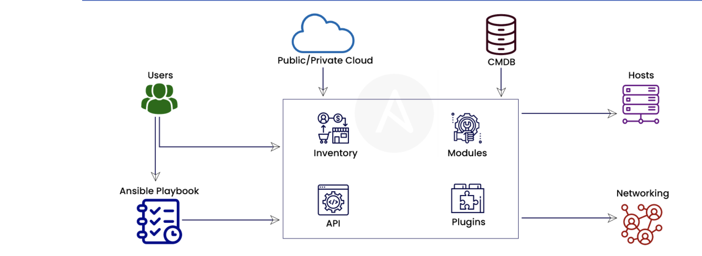

## Concepts et architecture Ansible

L’architecture Ansible propose deux types de machine : 
- les nœuds de contrôle: Ansible est installé et les playbooks sont exécutés depuis ces nœuds
- les hôtes gérés: les machines cibles, listés dans l'inventaire ansible


Un playbook est un fichier déclaratif au format YAML contenant un ou plusieurs plays

Un Play definit une tache, un etat souhaité qu'on veut appliquer à un ou plusieurs hôtes.

Chaque tâche exécute un module ansible.

Un inventaire est un fichier contenant les machines cibles et les éléments de connexions ainsi que les variables propres à votre déploiement.

Ansible est fourni avec des centaines de modules utiles qui peuvent accomplir une grande variété de tâches d’automatisation. Ils peuvent agir sur les fichiers système, installer des logiciels ou effectuer des appels d’API.


Les tâches, les plays et les playbooks sont conçus pour être idempotents. Cela signifie que vous pouvez exécuter en toute sécurité un playbook sur les mêmes hôtes plusieurs fois. Lorsque vos systèmes sont dans le bon état, le playbook n’effectue aucune modification lorsque vous l’exécutez.

Ansible utilise également des plug-ins. Les plug-ins sont du code que vous pouvez ajouter à Ansible pour l’étendre et l’adapter aux nouvelles utilisations et plateformes.



## Ansible Structure (Best Practice)


## Création d’un inventaire Ansible
Un inventaire définit une collection d’hôtes qu’Ansible va gérer. Ces hôtes peuvent également être affectés à des groupes , qui peuvent être gérés collectivement. 

hosts.yaml
```yaml
web1.example.com
web2.example.com
db1.example.com
db2.example.com
192.0.2.42
```

```yaml
[webservers]
web1.example.com
web2.example.com
192.0.2.42

[db-servers]
db1.example.com
db2.example.com
```

Les groupes dans l'inventaire peuvent etre imbriqués.

```yaml
[servers:children]
webservers
db-servers
```

### Vérification de l’inventaire

```sh
ansible webservers --list-hosts

ansible db-servers --list-hosts
```

## Gestion des fichiers de configuration Ansible

Ansible utilise un fichier de configuration spécifique suivant le use-case:

-  ./ansible.cfg

Si un fichier ansible.cfg existe dans le répertoire où est exécutée la commande ansible.
- ~/.ansible.cfg

Si un fichier .ansible.cfg dans le répertoire personnel de l’utilisateur.
- /etc/ansible/ansible.cfg

Si aucun autre fichier de configuration n’est trouvé.

Un aperçu du fichier ansible.cfg:
```yaml
[defaults] # définit les valeurs par défaut pour le fonctionnement d’Ansible

[privilege_escalation] # configure la manière dont Ansible effectue l’élévation des privilèges sur les hôtes gérés
inventory = ./inventory
remote_user = user
ask_pass = false

[privilege_escalation]
become = true
become_method = sudo
become_user = root
become_ask_pass = false
```

| Directive                  | Description                                          |
| :------------------------- | :--------------------------------------------------- |
| `inventory`                |  chemin d’accès au fichier d’inventaire.   |
| `remote_user`              |  	username à utiliser pour se connecter sur les hôtes. Si pas spécifié, le nom de l’utilisateur actuel est utilisé.              | 
| `ask_pass`                 | 	Indique s’il faut spécifier ou non un mot de passe SSH. false si on utilise l'authentification par clé publique SSH    |
| `become`                   |  Indique s’il faut changer automatiquement d’utilisateur sur l’hôte géré (généralement à root) après la connexion. Cela peut aussi être spécifié par un play.   |
| `become_method`            |  Comment changer d’utilisateur (généralement sudo, qui est la valeur par défaut, mais su est une possibilité).               | 
| `become_user`              | L’utilisateur vers lequel basculer sur l’hôte géré (généralement root, qui est la valeur par défaut).   |
| `become_ask_pass`          | Indique s’il faut demander ou non un mot de passe pour votre become_method. La valeur par défaut est false. |

## Écriture et exécution de playbooks
Les commandes ad hoc peuvent exécuter une tâche simple unique sur un ensemble d’hôtes ciblés en tant que commande ponctuelle. Toutefois, la puissance réelle d’Ansible réside dans l’utilisation des playbooks pour exécuter plusieurs tâches complexes.

Une `task` est l’application d’un module pour effectuer une unité de travail spécifique. 

Un `play` est une séquence de tâches à appliquer, dans l’ordre, à un ou plusieurs hôtes sélectionnés dans votre inventaire. 

Un `playbook` est un fichier texte contenant une liste d’un ou plusieurs plays à exécuter dans l’ordre.

### Formatage d’un playbook Ansible

Pour vous aider à comprendre le format d’un playbook, nous allons examiner une commande ad hoc:

```sh
ansible@ansible:~$ ansible -i hosts target -m user -a "name=newbie uid=4000 state=present" 
target | FAILED! => {
    "ansible_facts": {
        "discovered_interpreter_python": "/usr/bin/python3"
    }, 
    "changed": false, 
    "msg": "useradd: Permission denied.\nuseradd: cannot lock /etc/passwd; try again later.\n", 
    "name": "newbie", 
    "rc": 1
}

# Ansible indique qu'il a besoin d'un privilege plus eleve pour executer ce command


ansible@ansible:~$ ansible -i hosts target -m user -a "name=newbie uid=4000 state=present" --become
target | CHANGED => {
    "ansible_facts": {
        "discovered_interpreter_python": "/usr/bin/python3"
    }, 
    "changed": true, 
    "comment": "", 
    "create_home": true, 
    "group": 4000, 
    "home": "/home/newbie", 
    "name": "newbie", 
    "shell": "/bin/sh", 
    "state": "present", 
    "system": false, 
    "uid": 4000
}
```

Vous pouvez réécrire cette commande comme un play de tâche simple unique et l’enregistrer dans un playbook. Le playbook obtenu ressemble à ce qui suit :

```yaml
---
- name: Configure important user consistently
  hosts: targets
  become: yes
  tasks:
    - name: newbie exists with UID 4000
      user:
        name: newbie
        uid: 4000
        state: present
```

Un playbook est un fichier texte écrit au format YAML, dont l’extension est généralement yml.

Un playbook commence par une ligne composée de trois tirets (---) comme un marqueur de début de document. Il peut se terminer par trois points (...) comme un marqueur de fin de document, ce qui, dans la pratique, est souvent omis.

Voici un autre exemple d’un attribut tasks comprenant plusieurs tâches. Il utilise le module service pour garantir que plusieurs services réseau sont activés pour être lancés au démarrage :

```yaml
---
- name: Configure important user consistently
  hosts: targets
  become: yes
  tasks:
    - name: newbie exists with UID 4000
      user:
        name: newbie
        uid: 4000
        state: present

    - name: Install apache httpd
      apt:
        name: apache2
        state: present

    - name: web server is enabled
      service:
        name: apache2
        enabled: true
```

### Exécution de playbooks

La commande ansible-playbook sert à exécuter des playbooks. Cette commande est exécutée sur le nœud de contrôle et le nom du playbook à exécuter est transmis en tant qu’argument :

```sh
ansible@ansible:~$ ansible-playbook -i hosts my-playbook.yaml 

PLAY [Configure important user consistently] ***********************************************************************************************************************************

TASK [Gathering Facts] *********************************************************************************************************************************************************
ok: [target]

TASK [newbie exists with UID 4000] *********************************************************************************************************************************************
ok: [target]

TASK [Install apache httpd] ****************************************************************************************************************************************************
ok: [target]

TASK [web server is enabled] ***************************************************************************************************************************************************
ok: [target]

PLAY RECAP *********************************************************************************************************************************************************************
target                     : ok=4    changed=0    unreachable=0    failed=0    skipped=0    rescued=0    ignored=0  
```
### Augmentation de la verbosité de sortie

La commande ansible-playbook -v

### Vérification de la syntaxe
 La commande ansible-playbook propose une option --syntax-check que vous pouvez utiliser pour vérifier la syntaxe d’un playbook.
```sh
ansible@ansible:~$ ansible-playbook -i hosts --syntax-check my-playbook.yaml 

playbook: my-playbook.yaml
```

### Exécution d’un dry-run

Vous pouvez utiliser l’option -C pour effectuer un dry-run  de l’exécution du playbook.

```sh
ansible@ansible:~$ ansible-playbook -i hosts -C my-playbook.yaml 

PLAY [Configure important user consistently] ***********************************************************************************************************************************

TASK [Gathering Facts] *********************************************************************************************************************************************************
ok: [target]

TASK [newbie exists with UID 4000] *********************************************************************************************************************************************
ok: [target]

TASK [Install apache httpd] ****************************************************************************************************************************************************
ok: [target]

TASK [web server is enabled] ***************************************************************************************************************************************************
ok: [target]

PLAY RECAP *********************************************************************************************************************************************************************
target                     : ok=4    changed=0    unreachable=0    failed=0    skipped=0    rescued=0    ignored=0  
```

### Guided LAB
[Guided LAB - Step by step](./Guided-lab.md)

### Mise en œuvre de plusieurs plays dans un playbook
exemple

```yaml
---
- name: Configure important user consistently
  hosts: targets
  become: yes
  tasks:
    - name: newbie exists with UID 4000
      user:
        name: newbie
        uid: 4000
        state: present

    - name: Install apache httpd
      apt:
        name: apache2
        state: present

    - name: web server is enabled
      service:
        name: apache2
        enabled: true
# PLAY 2
- name: Configure DB
  hosts: targets
  become: yes
  tasks:
    - name: Install postgresql
      apt:
        name: postgresql
        state: present

# PLAY 3
- name: Test intranet web server
  hosts: localhost
  become: no
  tasks:
    - name: connect to intranet web server
      uri:
        url: http://target
        return_content: yes
        status_code: 200
```

## Gestion des variables et Facts

### Gestion des variables
#### Définition de variables dans des playbooks
Les variables de playbook peuvent être définies de plusieurs manières. Une façon courante consiste à placer la variable dans un bloc vars au début d’un playbook :
```yaml
- hosts: all
  vars:
    user: naruto
    home: /home/naruto
```

Il est également possible de définir des variables de playbook dans des fichiers externes. 

```yaml
- hosts: all
  vars_files:
    - vars/users.yml
```

users.yml file:

```yaml
user: naruto
home: /home/naruto
```

#### Utilisation de variables dans des playbooks

```yaml
vars:
  user: naruto

tasks:
  # This line will read: Creates the user joe
  - name: Creates the user {{ user }}
    user:
      # This line will create the user named Joe
      name: "{{ user }}"
```


#### Variables d’hôte et variables de groupe

les variables d’hôtes, qui s’appliquent à un hôte spécifique , et les variables de groupe, qui s’appliquent à tous les hôtes d’un groupe d’hôtes ou d’un groupe de groupes d’hôtes. 

La structure de répertoire pour l’exemple de projet:

```yaml
project
├── ansible.cfg
├── group_vars
│   ├── datacenters
│   ├── datacenters1
│   └── datacenters2
├── host_vars
│   ├── demo1.example.com
│   ├── demo2.example.com
│   ├── demo3.example.com
│   └── demo4.example.com
├── inventory
└── playbook.yml
```

### Capture de la sortie d’une commande avec des variables enregistrées

Vous pouvez utiliser l’instruction `register` pour capturer le résultat d’une commande. Le résultat est alors enregistré dans une variable temporaire qui pourra servir par la suite dans le playbook au débogage ou à d’autres fins, par exemple pour une configuration donnée liée au résultat d’une commande.

Le playbook suivant montre comment capturer la sortie d’une commande à des fins de débogage.

```yaml
---
- name: Installs a package and prints the result
  hosts: all
  tasks:
    - name: Install the package
      yum:
        name: httpd
        state: installed
      register: install_result

    - debug:
        var: install_result
```
### Gestion des secrets avec ansible-vault 
#### Création d’un fichier chiffré
Le chiffrement utilisé pour protéger les fichiers est au format AES256.

```sh
ansible@ansible:~$ ansible-vault create secret.yml
New Vault password: passer123
Confirm New Vault password: passer123
```
Au lieu d’entrer le mot de passe Vault par une saisie normale, vous pouvez utiliser un fichier de mot de passe Vault pour stocker le mot de passe Vault. Vous devez protéger ce fichier avec soin au moyen d’autorisations de fichiers, entre autres moyens.


```sh
ansible@ansible:~$ ansible-vault create --vault-password-file=vault-pass secret.yml
```
#### Consultation d’un fichier chiffré
```sh
ansible@ansible:~$ ansible-vault view secret.yml
Vault password: passer123
my_secret: "yJJvPqhsiusmmPPZdnjndkdnYNDjdj782meUZcw"
```
#### Déchiffrement d’un fichier existant

```sh
ansible@ansible:~$ ansible-vault decrypt secret1.yml --output=secret1-decrypted.yml
Vault password: passer123
Decryption successful
```

#### Modification d’un fichier chiffré existant
```sh
ansible@ansible:~$ ansible-vault edit secret.yml
Vault password: passer123
```

#### Modification du mot de passe d’un fichier chiffré

```sh
ansible@ansible:~$  ansible-vault rekey secret.yml
Vault password: redhat
New Vault password: RedHat
Confirm New Vault password: RedHat
Rekey successful
```

Lorsqu’un fichier de mot de passe Vault est utilisé, faites appel à l’option --new-vault-password-file :

```sh
ansible@ansible:~$  ansible-vault rekey \
> --new-vault-password-file=NEW_VAULT_PASSWORD_FILE secret.yml
```

#### Playbooks et Ansible Vault

Pour exécuter un playbook qui accède à des fichiers chiffrés avec Ansible Vault, vous devez fournir le mot de passe de chiffrement dans la commande ansible-playbook. Si vous ne fournissez pas le mot de passe, le playbook renvoie une erreur :

```sh
ansible@ansible:~$ ansible-playbook site.yml
ERROR: A vault password must be specified to decrypt vars/api_key.yml
```


Pour fournir le mot de passe Vault au playbook, utilisez l’option --vault-id. Par exemple, pour fournir le mot de passe Vault de manière interactive, utilisez --vault-id @prompt comme illustré dans l’exemple suivant :

```sh
ansible@ansible:~$ ansible-playbook --vault-id @prompt site.yml
Vault password (default): passer123
```

Vous pouvez également utiliser l’option --vault-password-file pour spécifier un fichier qui stocke le mot de passe de chiffrement en texte clair.

```sh
ansible@ansible:~$ ansible-playbook --vault-password-file=vault-pw-file site.yml
```

### Gestion des facts
les facts sont des variables détectées automatiquement par Ansible sur un hôte géré.

Pour voir quels faits sont collectés pour vos hôtes gérés, exécutez un court playbook qui rassemble des faits et utilise le module debug pour imprimer la valeur de la variable ansible_facts.

```yaml
- name: Fact dump
  hosts: all
  tasks:
    - name: Print all facts
      debug:
        var: ansible_facts
```

#### utilisation facts dans un playbook

```yaml
---
- hosts: all
  tasks:
  - name: Prints various Ansible facts
    debug:
      msg: >
        The default IPv4 address of {{ ansible_facts.fqdn }}
        is {{ ansible_facts.default_ipv4.address }} 
```

## Simplification des playbooks avec des rôles

Au fur et à mesure que vous développerez plus de playbooks, vous découvrirez probablement que vous avez de nombreuses possibilités de réutiliser le code des playbooks que vous avez déjà écrits. 


### structure des rôles Ansible

```sh
ansible@ansible:roles$  tree motd
motd/
├── defaults # contient les valeurs par défaut des variables de rôle
│   └── main.yml
├── files # contient des fichiers statiques auxquels les tâches du rôle font référence.
├── handlers # contient les définitions du gestionnaire du rôle.
│   └── main.yml
├── meta # contient des informations sur le rôle, parmi lesquelles l’auteur, la licence, les plateformes et les dépendances en option du rôle.
│   └── main.yml
├── README.md
├── tasks # contient les définitions des tâches du rôle.
│   └── main.yml
├── templates # contient des modèles Jinja2 auxquels les tâches du rôle font référence.
├── tests # peut contenir un inventaire et un playbook test.yml qui peuvent être utilisés pour tester le rôle
│   ├── inventory
│   └── test.yml
└── vars # définit les valeurs des variables du rôle
    └── main.yml
```
### Utilisation de rôles Ansible dans un playbook

```yaml
---
- hosts: target
  roles:
    - role1
    - role2
```

L’exemple suivant définit les valeurs de deux variables de rôle de role2, var1 et var2. Toutes les variables defaults et vars sont remplacées lorsque role2 est utilisé.
```yaml
---
- hosts: target
  roles:
    - role: role1
    - role: role2
      var1: val1
      var2: val2
```
### Création d’un squelette de rôle

Vous pouvez exécuter `ansible-galaxy init `pour créer la structure de répertoire pour un nouveau rôle.

```sh
ansible@ansible: playbook-project$ cd roles
ansible@ansible:roles$ ansible-galaxy init my_new_role
- my_new_role was created successfully
ansible@ansible:roles$ ls my_new_role/
defaults  files  handlers  meta  README.md  tasks  templates  tests  vars
```

### Définition du contenu du rôle

Une fois que vous avez créé la structure de répertoire, vous devez écrire le contenu du rôle. Un bon endroit pour commencer est le fichier de tâches ROLENAME/tasks/main.yml qui est la liste principale des tâches exécutées par le rôle.

```sh
ansible@ansible: playbook-project$ cat roles/motd/tasks/main.yml
---
# tasks file for motd

- name: deliver motd file
  template:
    src: motd.j2
    dest: /etc/motd
    owner: root
    group: root
    mode: 0444
```

La commande suivante affiche le contenu du modèle motd.j2 du rôle motd. Elle fait référence à des faits Ansible et à une variable system_owner.

```sh
ansible@ansible: playbook-project$ cat roles/motd/templates/motd.j2
This is the system {{ ansible_facts['hostname'] }}.

Today's date is: {{ ansible_facts['date_time']['date'] }}.

Only use this system with permission.
You can ask {{ system_owner }} for access.
```

Le fichier defaults/main.yml suivant définit la variable system_owner sur user@target. Il s’agit de l’adresse électronique inscrite dans le fichier /etc/motd des hôtes gérés auxquels ce rôle est appliqué.

```sh
ansible@ansible: playbook-project$ cat roles/motd/defaults/main.yml
---
system_owner: user@host.example.com
```

### Utilisation du rôle dans un playbook

```sh
ansible@ansible: playbook-project$ cat use-motd-role.yml
---
- name: use motd role playbook
  hosts: target
  remote_user: ansible
  become: true
  roles:
    - motd
```
Lors de l’exécution du playbook, les tâches effectuées conformément à un rôle peuvent être identifiées par le préfixe du nom de rôle. L’exemple de sortie suivant illustre ceci avec le préfixe motd: dans le nom de la tâche :

```sh
ansible@ansible: playbook-project$ ansible-playbook -i inventory use-motd-role.yml
```