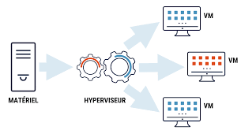
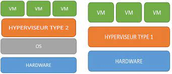

# Vagrant
## Introduction

Ce document permet d'introduire Vagrant et vous donne la possibilité de mieux l'utiliser dans votre quotidien.

## Concepts

HashiCorp decrit vagrant comme `un tools qui permet à la fois de créer et de gerer des environnements de machines virtuelles`. Vagrant fonctionne par le biai d'un systeme de virtualisation. On pourrait alors se demander ce qu'est la virtualisation?

### Virtualisation

La virtualisation consiste à créer une ou plusieurs machines virtuelles à partir d'une machine physique.



Les machines virtuelles sont contrôlées et créer à travers un outil appelé `hyperviseur` qui permet d'allouer du CPU/Memoire à nos VM

### Hyperviseur



### Vagrant

Vagrant permet de créer des environnements virtuels portables via une configuration simple, réutilisable et jetable.

## Lab00 - Prerequisites
- [Install Vagrant](https://developer.hashicorp.com/vagrant/downloads)
- Install un  logiciel de virtualisation [VirtualBox](https://www.virtualbox.org/), [VMware Fusion](https://customerconnect.vmware.com/downloads/get-download?downloadGroup=FUS-PUBTP-2021H1), ou [Hyper-V](https://docs.microsoft.com/en-us/virtualization/hyper-v-on-windows/quick-start/enable-hyper-v)


## Command-Line Interface

L'utilisation de toute la puissance de Vagrant se fait via CLI

les ous-commandes les plus utilisés:

```sh
# Pour demarrer ta configuration Vagrant
vagrant up

#Pour détruire la conf
vagrant destroy

# Help
vagrant -h

# initialiser un vagrant file
vagrant init 
```

