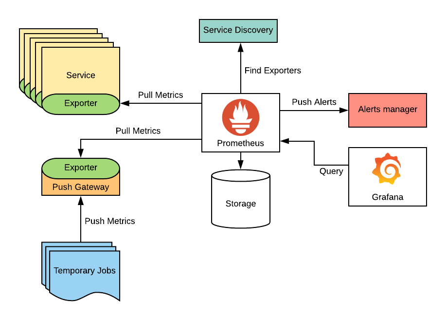

# Présentation de Prometheus

## Introduction

**Prometheus** est un système de monitoring et d'alerte open source conçu pour collecter des métriques sur l'infrastructure, les applications et les services, principalement dans des environnements cloud et containerisés. Il est devenu l'un des outils de monitoring les plus populaires, notamment dans les écosystèmes **Kubernetes** et **DevOps**, en raison de sa flexibilité, de sa scalabilité, et de son modèle de données time-series.

Prometheus fait partie de la **Cloud Native Computing Foundation (CNCF)** et est couramment utilisé pour surveiller les performances, générer des alertes en temps réel et aider au diagnostic de pannes.

---

## 1. Architecture de Prometheus

L'architecture de Prometheus est modulaire, avec plusieurs composants qui interagissent entre eux pour permettre une surveillance complète des systèmes.



### 1.1 Serveur Prometheus
Le **serveur Prometheus** est le cœur du système. Il est responsable de la collecte des métriques, du stockage des séries temporelles, de l'évaluation des alertes et de la génération de requêtes pour l'analyse des données.

### 1.2 Exporters
Les **exporters** sont des applications qui exposent les métriques sous un format que Prometheus peut comprendre. Ces exporters sont souvent utilisés pour surveiller des composants comme des bases de données (ex : **Node Exporter** pour surveiller les serveurs Linux, **MySQL Exporter**, etc.).

### 1.3 Service Discovery
Prometheus utilise des mécanismes de **service discovery** pour découvrir dynamiquement les cibles à surveiller, comme les instances Kubernetes ou des serveurs dans le cloud. Cela permet de maintenir à jour automatiquement la liste des ressources à surveiller.

### 1.4 Alertmanager
L'**Alertmanager** est un composant dédié qui gère les alertes générées par le serveur Prometheus. Il permet de définir des règles d'alertes basées sur les métriques collectées et de notifier les équipes par email, Slack, ou d'autres systèmes.

### 1.5 Clients Grafana
Prometheus n'a pas d'interface utilisateur sophistiquée pour les tableaux de bord, mais il est souvent couplé à **Grafana**, qui permet de visualiser les données collectées par Prometheus sous forme de graphiques et tableaux de bord interactifs.

---

## 2. Concepts Clés de Prometheus

### 2.1 Modèle de Données Time-Series
Prometheus stocke les données sous forme de **séries temporelles** (time-series), c'est-à-dire un ensemble de points de données horodatés qui suivent l'évolution d'une métrique dans le temps.

- **Métriques** : Les métriques sont des valeurs numériques suivies dans le temps, telles que l'utilisation du CPU, la mémoire ou les requêtes HTTP.
- **Labels** : Chaque métrique est associée à un ou plusieurs **labels**, qui permettent de les identifier et de les regrouper. Par exemple, une métrique d'utilisation de CPU pourrait avoir un label identifiant le nom du serveur.

### 2.2 Pull Model
Prometheus utilise un modèle de **pull** pour récupérer les métriques. Cela signifie que le serveur Prometheus interroge régulièrement les services surveillés pour collecter les données, plutôt que les services ne poussent les métriques vers Prometheus.

### 2.3 Targets (Cibles)
Les **targets** représentent les instances à surveiller. Une target peut être un serveur, un service, ou un conteneur exposant des métriques via un endpoint HTTP. Prometheus surveille ces cibles en envoyant des requêtes HTTP régulières (scrapes) pour collecter les métriques.

### 2.4 Expressions de Requêtes (PromQL)
**PromQL** est le langage de requêtes de Prometheus, utilisé pour interroger les métriques et manipuler les séries temporelles. Il permet de créer des alertes, de calculer des moyennes, des taux d'erreurs, ou encore de générer des tableaux de bord.

---

## 3. Fonctionnalités de Prometheus

### 3.1 Monitoring des Séries Temporelles
Prometheus surveille les séries temporelles et stocke des données sur l'évolution des métriques au fil du temps, offrant ainsi une vue d'ensemble de la santé des systèmes et des tendances de performance.

### 3.2 Scraping des Métriques
Le **scraping** consiste à interroger régulièrement les endpoints des cibles pour récupérer les métriques sous un format compréhensible par Prometheus. Cette méthode est utilisée pour recueillir des données à intervalles réguliers.

### 3.3 Alerte et Notification
Prometheus génère des alertes basées sur des règles définies à partir des métriques. Par exemple, une alerte peut être déclenchée si l'utilisation du CPU dépasse un certain seuil pendant un certain temps.

Les alertes sont envoyées à l'Alertmanager, qui peut les router vers différentes destinations :
- Email
- Slack
- PagerDuty
- Webhooks

### 3.4 Requêtes avec PromQL
**PromQL (Prometheus Query Language)** permet d'interroger les séries temporelles pour effectuer des calculs sur les métriques (moyennes, taux d'erreurs, tendances) et générer des alertes ou des rapports personnalisés. Voici un exemple de requête qui calcule l'utilisation moyenne du CPU sur 5 minutes :
```promql
avg(rate(cpu_usage_seconds_total[5m]))
```

### 3.5 Exporters
Prometheus utilise des **exporters** pour collecter des métriques à partir de services ou d'applications spécifiques. Il existe de nombreux exporters disponibles, dont :
- **Node Exporter** : Pour surveiller les serveurs Linux (CPU, mémoire, disque).
- **MySQL Exporter** : Pour collecter des métriques MySQL (temps de réponse, nombre de requêtes).
- **Blackbox Exporter** : Pour surveiller la disponibilité des services via des pings ou des tests HTTP.

---

## 4. Cas d'Utilisation et Intégrations

### 4.1 Surveillance des Environnements Kubernetes
Prometheus est particulièrement bien adapté pour surveiller les clusters **Kubernetes**. Il peut automatiquement découvrir les pods et services Kubernetes, les surveiller, et générer des alertes basées sur la santé des conteneurs, des services ou des pods.

### 4.2 Intégration avec Grafana
Prometheus est souvent couplé avec **Grafana** pour créer des tableaux de bord interactifs qui permettent de visualiser les données des séries temporelles collectées par Prometheus. Cette intégration permet de suivre facilement les performances des services, avec des graphiques dynamiques.

### 4.3 Monitoring des Services Cloud
Prometheus peut également surveiller des environnements cloud comme **AWS**, **Azure**, ou **GCP** en utilisant des exporters spécifiques pour collecter des métriques à partir des services cloud (utilisation des ressources, disponibilité des services, latence).

---

## 5. Prometheus dans un Contexte DevOps

### 5.1 Automatisation et Alerte Proactive
Prometheus aide les équipes DevOps à surveiller les applications et l'infrastructure en temps réel, avec des alertes proactives. Cela permet de réagir rapidement aux pannes ou aux anomalies.

### 5.2 Monitoring Centré sur les Applications
Prometheus permet aux équipes de surveiller non seulement l'infrastructure, mais également les applications, grâce à des métriques personnalisées. Les développeurs peuvent exposer des métriques spécifiques à leur application (ex : temps de réponse d'une API) via des endpoints que Prometheus scrutera.

### 5.3 Scalabilité
Grâce à son architecture modulaire, Prometheus est hautement scalable et peut surveiller un grand nombre de cibles. Des instances supplémentaires de Prometheus peuvent être utilisées pour collecter des métriques de différentes parties d'une infrastructure complexe.

---

## 6. Bonnes Pratiques avec Prometheus

- **Définir des métriques pertinentes** : Assurez-vous de surveiller les métriques qui ont un impact direct sur la performance et la stabilité de votre infrastructure.
- **Optimisation du Scraping** : Configurez des intervalles de scraping appropriés pour ne pas surcharger votre infrastructure tout en maintenant une fréquence de collecte adaptée.
- **Alerter avec Parcimonie** : Utilisez des alertes intelligentes pour éviter le bruit d'alertes excessives et concentrez-vous sur les incidents critiques.
- **Intégration avec Grafana** : Utilisez Grafana pour créer des tableaux de bord visuels qui permettent de suivre facilement les performances de votre infrastructure.

---

## Conclusion

**Prometheus** est un outil puissant et flexible pour surveiller les infrastructures modernes, en particulier dans les environnements cloud et conteneurisés. Grâce à son architecture modulaire, son langage de requêtes PromQL, et ses intégrations avec des outils comme Grafana, Prometheus permet de surveiller les métriques en temps réel, de générer des alertes, et d'automatiser la gestion des incidents.

Pour les équipes DevOps, Prometheus est un choix incontournable pour la surveillance proactive des systèmes et la détection rapide des problèmes avant qu'ils n'affectent les utilisateurs.
