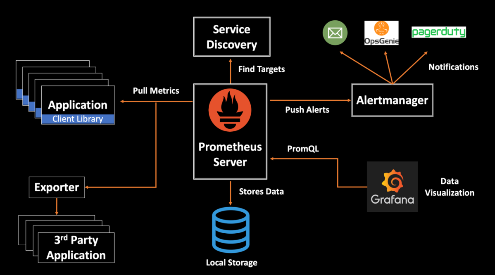

# Présentation de Grafana

## Introduction

**Grafana** est un outil open source de visualisation et d'analyse de données conçu pour créer des tableaux de bord interactifs à partir de différentes sources de données. Il est couramment utilisé pour la surveillance des infrastructures, des applications, et des métriques, en particulier en combinaison avec des systèmes de monitoring tels que **Prometheus**, **InfluxDB**, **Elasticsearch**, et bien d'autres. 

Grafana se distingue par sa capacité à fournir des visualisations dynamiques et personnalisables, ainsi que par son intégration avec des outils de gestion d'alertes, rendant cet outil indispensable dans les environnements DevOps et les systèmes d'exploitation à grande échelle.

## 1. Architecture de Grafana

### 1.1 Backend
Le **backend** de Grafana est responsable de la gestion des utilisateurs, des connexions aux bases de données, de la gestion des sessions et de l'envoi des alertes. Il s'agit du cœur du système qui communique avec les sources de données pour interroger et récupérer les informations.

### 1.2 Frontend
L'interface utilisateur de Grafana est construite avec des technologies web modernes, offrant une expérience utilisateur interactive. C'est là que les utilisateurs créent, modifient et partagent des tableaux de bord pour visualiser les données collectées sous forme de graphiques, de tableaux, de jauges, etc.

### 1.3 Datasources
Grafana peut se connecter à diverses sources de données pour récupérer des métriques et des journaux. Les **datasources** supportées incluent :
- **Prometheus** : Système de monitoring et de collecte de métriques.
- **InfluxDB** : Base de données orientée séries temporelles.
- **Elasticsearch** : Moteur de recherche et d'analyse de logs.
- **Graphite** : Système de collecte de métriques.
- **MySQL, PostgreSQL, etc.** : Bases de données relationnelles pour des analyses de données complexes.

## 2. Concepts Clés de Grafana

### 2.1 Dashboards (Tableaux de Bord)
Les **dashboards** sont au cœur de Grafana. Ils permettent de visualiser en temps réel des données provenant de multiples sources, avec la possibilité de personnaliser les visualisations selon les besoins.

#### Fonctionnalités des Dashboards :
- **Panels** : Chaque dashboard est composé de panneaux (**panels**) qui affichent les visualisations de données sous forme de graphiques, jauges, diagrammes, cartes, etc.
- **Variables** : Grafana permet l'utilisation de variables dans les dashboards pour filtrer et ajuster dynamiquement les visualisations selon les besoins (ex : filtrer par application, par serveur, par région).
- **Annotations** : Les annotations ajoutent des marqueurs sur les graphiques pour signaler des événements importants (ex : déploiements, incidents).

### 2.2 Graphiques et Visualisations
Grafana propose une variété de visualisations interactives, notamment :
- **Graphiques Linéaires et Barres** : Pour visualiser l'évolution des métriques dans le temps.
- **Heatmaps** : Pour représenter les variations des données sur une période donnée.
- **Jauges et Statistiques** : Pour surveiller des KPI (indicateurs de performance clés) spécifiques.
- **Alertes Visuelles** : Vous pouvez configurer des seuils d'alerte qui modifient les couleurs des graphiques lorsque certaines valeurs sont atteintes.

### 2.3 Prometheus et Grafana
Grafana est souvent couplé avec **Prometheus** pour la surveillance des infrastructures et des applications. Prometheus collecte les données, tandis que Grafana est utilisé pour visualiser ces données de manière claire et dynamique via des tableaux de bord.

## 3. Fonctionnalités de Grafana

### 3.1 Intégration avec de Multiples Sources de Données
Grafana est conçu pour être agnostique en matière de sources de données. Il permet de combiner des données provenant de plusieurs systèmes dans un seul tableau de bord. Par exemple, vous pouvez surveiller des métriques système avec **Prometheus** et analyser des journaux d'erreurs avec **Elasticsearch**, le tout dans une interface unique.

### 3.2 Création d'Alertes
Grafana offre un système d'alerte puissant qui permet de définir des conditions basées sur les données collectées. Vous pouvez configurer des alertes pour être notifié par email, Slack, ou d'autres services lorsque certains seuils sont dépassés.

#### Processus d'Alerte :
- **Conditions d'Alerte** : Basées sur des règles prédéfinies dans les panels (ex : déclencher une alerte si l'utilisation du CPU dépasse 90% pendant plus de 5 minutes).
- **Notifications** : Les notifications peuvent être envoyées via des services tels que **Slack**, **PagerDuty**, ou **email**.

### 3.3 Variables Dynamiques
Les **variables** permettent de rendre les tableaux de bord plus dynamiques et interactifs. Les utilisateurs peuvent sélectionner des valeurs spécifiques à partir d'un menu déroulant pour ajuster les données visualisées. Par exemple, vous pouvez configurer des tableaux de bord qui changent en fonction des serveurs ou des environnements surveillés (dev, prod, etc.).

### 3.4 Partage et Collaboration
Grafana permet le partage facile des tableaux de bord avec d'autres membres de l'équipe ou même à un public plus large. Vous pouvez :
- **Partager un lien** : Envoyer un lien vers un tableau de bord en lecture seule.
- **Intégrer les graphiques** : Intégrer un graphique spécifique dans un site web ou un portail intranet.
- **Exporter/Importer des Dashboards** : Enregistrer les tableaux de bord sous forme de fichiers JSON et les réimporter dans d'autres instances Grafana.

## 4. Plugins Grafana

Grafana dispose d'une riche bibliothèque de **plugins** qui étendent ses capacités en ajoutant de nouvelles fonctionnalités et intégrations.

### Types de Plugins :
- **Plugins de Visualisation** : Ajoutent de nouveaux types de graphiques, comme des diagrammes de Gantt, des chronogrammes, ou des diagrammes de flux.
- **Plugins de Datasource** : Ajoutent des sources de données supplémentaires (ex : MongoDB, Cloudwatch, etc.).
- **Plugins d'Alerting** : Étendent les capacités d'alerte en s'intégrant avec des services comme **OpsGenie**, **VictorOps**, et bien d'autres.

## 5. Intégrations DevOps avec Grafana

### 5.1 Monitoring avec Prometheus et Alertmanager
Grafana est couramment utilisé dans les environnements **Kubernetes** et **cloud-native** en association avec **Prometheus** pour surveiller l'infrastructure. Les données collectées par Prometheus sont visualisées dans Grafana et les alertes sont gérées par **Alertmanager**.

### 5.2 Intégration avec CI/CD
Dans un pipeline CI/CD, Grafana peut surveiller l'état des builds, la performance des tests et les déploiements dans les environnements cloud, en se connectant à des outils comme **Jenkins**, **GitLab**, ou **CircleCI**.

### 5.3 Intégration avec des Outils de Gestion des Logs
Grafana peut être utilisé pour analyser et visualiser les logs à l'aide de **Loki** (un outil de collecte de logs), ou d'autres solutions comme **Elasticsearch**. Cela permet d'avoir une vue unifiée sur les métriques de performance et les événements des logs d'erreur.

## 6. Bonnes Pratiques avec Grafana

### 6.1 Centralisation des Données
Utilisez Grafana pour centraliser toutes les sources de données dans un seul outil. Cela permet d'avoir une vue d'ensemble des métriques et des journaux provenant de différents systèmes, facilitant ainsi le diagnostic des incidents.

### 6.2 Création de Dashboards Dynamiques
Utilisez les **variables** pour créer des tableaux de bord dynamiques qui peuvent être facilement ajustés en fonction des besoins sans avoir à modifier les panels manuellement.

### 6.3 Mise en Place d'Alerte Proactive
Configurez des alertes basées sur des seuils critiques pour détecter les problèmes avant qu'ils n'impactent les utilisateurs. Assurez-vous que les notifications sont bien configurées pour atteindre les équipes pertinentes en temps réel.

## Conclusion

**Grafana** est une plateforme puissante et flexible pour la visualisation et l'analyse de données provenant de diverses sources. Que ce soit pour surveiller des infrastructures cloud, visualiser des métriques de performances d'applications, ou analyser des journaux, Grafana permet de centraliser et d'exploiter les données critiques de manière visuelle et interactive.

Dans un contexte **DevOps**, Grafana joue un rôle crucial dans l'observabilité, permettant aux équipes de réagir rapidement aux anomalies et d'améliorer la performance des systèmes. Avec ses nombreuses intégrations, son système d'alerte et ses tableaux de bord dynamiques, Grafana est un outil incontournable pour la gestion des environnements complexes.
